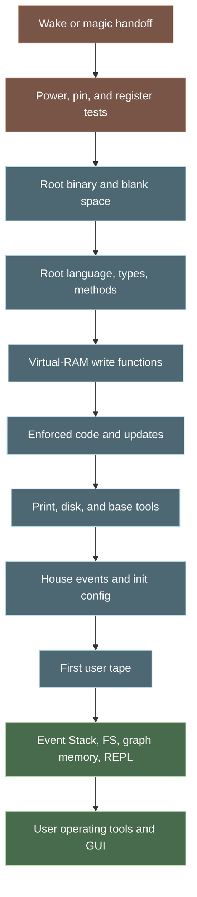
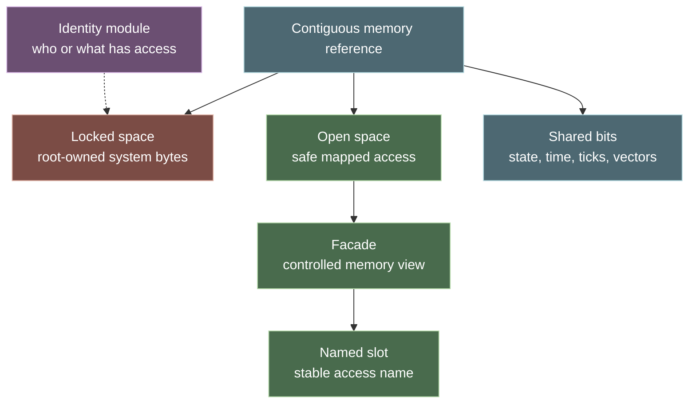
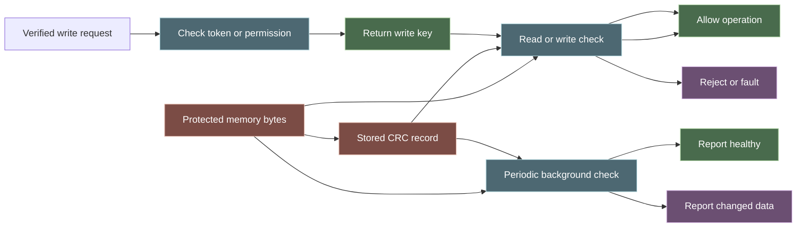
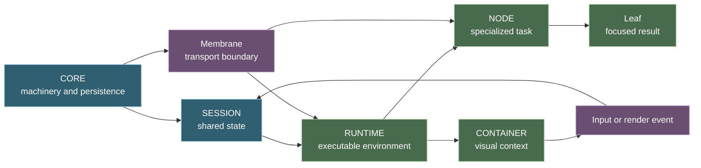
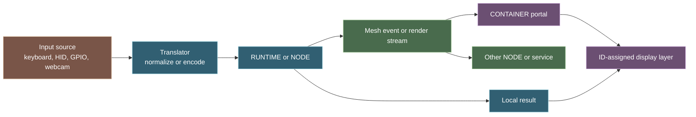

# Introducing the VOL Core

Status: Draft
Last-Touched: 2026-08-23
Depends-On: [docs/core/boot.md](../../docs/core/boot.md), [docs/core/zero-suite.md](../../docs/core/zero-suite.md), [docs/core/frame-context.md](../../docs/core/frame-context.md), [docs/core/Procedure Graph.md](../../docs/core/Procedure%20Graph.md), [docs/core/graph pointer.md](../../docs/core/graph%20pointer.md), [docs/core/graph stepper.md](../../docs/core/graph%20stepper.md), [docs/core/graph functions.md](../../docs/core/graph%20functions.md), [docs/core/structure.md](../../docs/core/structure.md), [docs/memory/first.md](../../docs/memory/first.md), [docs/memory/init-slots.md](../../docs/memory/init-slots.md), [docs/memory/Single Identity.md](../../docs/memory/Single%20Identity.md)

## Verbatim Scope

[docs/core/terminology.md](../../docs/core/terminology.md), [docs/core/structure.md](../../docs/core/structure.md), [docs/core/os-runtime.md](../../docs/core/os-runtime.md),
[docs/core/boot.md](../../docs/core/boot.md), [docs/core/kernel.md](../../docs/core/kernel.md), [docs/core/system core.md](../../docs/core/system%20core.md),
[docs/core/zero-suite.md](../../docs/core/zero-suite.md), [docs/core/first moments.md](../../docs/core/first%20moments.md),
[docs/core/frame-context.md](../../docs/core/frame-context.md), [docs/core/Procedure Graph.md](../../docs/core/Procedure%20Graph.md),
[docs/core/graph pointer.md](../../docs/core/graph%20pointer.md), [docs/core/graph stepper.md](../../docs/core/graph%20stepper.md),
[docs/core/graph functions.md](../../docs/core/graph%20functions.md), [docs/core/graph key names.md](../../docs/core/graph%20key%20names.md),
[docs/core/graph node compass.md](../../docs/core/graph%20node%20compass.md), [docs/core/Contigious address names.md](../../docs/core/Contigious%20address%20names.md),
[docs/core/Root Fundamental apps.md](../../docs/core/Root%20Fundamental%20apps.md), [docs/core/adding as compiled module.md](../../docs/core/adding%20as%20compiled%20module.md),
[docs/core/core crystal updates.md](../../docs/core/core%20crystal%20updates.md),
[docs/memory/first.md](../../docs/memory/first.md), [docs/memory/init-slots.md](../../docs/memory/init-slots.md),
[docs/memory/Single Identity.md](../../docs/memory/Single%20Identity.md),
[docs/discussion/new paradigm.md](../../docs/discussion/new%20paradigm.md), [docs/discussion/gnu.md](../../docs/discussion/gnu.md)

Additional source notes reviewed for this revision:

- [docs/article.txt](../../docs/article.txt)
- [docs/big-ints.md](../../docs/big-ints.md)
- [docs/congious data walkers - data addressing.md](../../docs/congious%20data%20walkers%20-%20data%20addressing.md)
- [docs/concepts/memory-as-weights-and-biases.md](../../docs/concepts/memory-as-weights-and-biases.md)
- [docs/container-manifest.md](../../docs/container-manifest.md)
- [docs/crc-service.md](../../docs/crc-service.md)
- [docs/display (container).md](../../docs/display%20%28container%29.md)
- [docs/Facade.md](../../docs/Facade.md)
- [docs/first-apps.md](../../docs/first-apps.md)
- [docs/garbage collector.md](../../docs/garbage%20collector.md)
- [docs/Genesis-Origin.md](../../docs/Genesis-Origin.md)
- [docs/inputs.md](../../docs/inputs.md)
- [docs/links.md](../../docs/links.md)
- [docs/loading statement sheets.txt](../../docs/loading%20statement%20sheets.txt)
- [docs/mesh.md](../../docs/mesh.md)
- [docs/multiprocessing.md](../../docs/multiprocessing.md)
- [docs/nodes.md](../../docs/nodes.md)
- [docs/python-notes.md](../../docs/python-notes.md)
- [docs/Radicle.md](../../docs/Radicle.md)
- [docs/references.md](../../docs/references.md)
- [docs/registry.md](../../docs/registry.md)
- [docs/Scaling.md](../../docs/Scaling.md)
- [docs/self assembly vocul functions.md](../../docs/self%20assembly%20vocul%20functions.md)
- [docs/tape.md](../../docs/tape.md)
- [docs/the loop.md](../../docs/the%20loop.md)
- [docs/top level.md](../../docs/top%20level.md)
- [docs/(easter)-bunny.md](../../docs/%28easter%29-bunny.md) (empty; no claims used)

Root-monolith source files reviewed:

- [docs/root-monolith/Frame Switching.md](../../docs/root-monolith/Frame%20Switching.md)
- [docs/root-monolith/applying-vol-runtime-libs.md](../../docs/root-monolith/applying-vol-runtime-libs.md)
- [docs/root-monolith/byte-function-load.md](../../docs/root-monolith/byte-function-load.md)
- [docs/root-monolith/commands.md](../../docs/root-monolith/commands.md)
- [docs/root-monolith/comprehensive.md](../../docs/root-monolith/comprehensive.md)
- [docs/root-monolith/graph-walk.md](../../docs/root-monolith/graph-walk.md)
- [docs/root-monolith/memory-module.md](../../docs/root-monolith/memory-module.md)
- [docs/root-monolith/phases.md](../../docs/root-monolith/phases.md)
- [docs/root-monolith/phase-0.md](../../docs/root-monolith/phase-0.md)
- [docs/root-monolith/readme.md](../../docs/root-monolith/readme.md)
- [docs/root-monolith/security research.md](../../docs/root-monolith/security%20research.md)
- [docs/root-monolith/stack-processing.md](../../docs/root-monolith/stack-processing.md)
- [docs/root-monolith/step addresses and layers.md](../../docs/root-monolith/step%20addresses%20and%20layers.md)

The source notes [docs/links.md](../../docs/links.md),
[docs/references.md](../../docs/references.md), and
[docs/python-notes.md](../../docs/python-notes.md) were treated as reference
lists only; their external links were not used as normative VOL behavior.

Supporting synthesis consulted:

- [ai-docs/boot-sequence-linear.md](../../ai-docs/boot-sequence-linear.md)
- [ai-docs/sections/graph-overview.md](../../ai-docs/sections/graph-overview.md)
- [ai-docs/graph-boundary-outline.md](../../ai-docs/graph-boundary-outline.md)
- [ai-docs/frame-model-skeleton.md](../../ai-docs/frame-model-skeleton.md)
- [ai-docs/root-monolith-phase-sequence-extraction.md](../../ai-docs/root-monolith-phase-sequence-extraction.md)
- [ai-docs/root-monolith-phase-0-extraction.md](../../ai-docs/root-monolith-phase-0-extraction.md)
- [ai-docs/root-monolith-libs-extraction.md](../../ai-docs/root-monolith-libs-extraction.md)
- [ai-docs/root-monolith-security-init-extraction.md](../../ai-docs/root-monolith-security-init-extraction.md)
- [ai-docs/root-monolith-comprehensive-extraction.md](../../ai-docs/root-monolith-comprehensive-extraction.md)
- [ai-docs/root-monolith-monolith-readme-extraction.md](../../ai-docs/root-monolith-monolith-readme-extraction.md)
- [ai-docs/root-monolith-byte-function-load-extraction.md](../../ai-docs/root-monolith-byte-function-load-extraction.md)
- [ai-docs/root-monolith-triage.md](../../ai-docs/root-monolith-triage.md)
- [ai-docs/mesh-roles-matrix.md](../../ai-docs/mesh-roles-matrix.md)
- [ai-docs/root-monolith-step-addresses-layers-extraction.md](../../ai-docs/root-monolith-step-addresses-layers-extraction.md)
- [ai-docs/sections/glossary.md](../../ai-docs/sections/glossary.md)
- [ai-docs/sections/core-runtime.md](../../ai-docs/sections/core-runtime.md)
- [ai-docs/memory-identity-overview.md](../../ai-docs/memory-identity-overview.md)
- [ai-docs/memory-identity-states.md](../../ai-docs/memory-identity-states.md)
- [ai-docs/VOL-Technical-Overview.md](../../ai-docs/VOL-Technical-Overview.md)
- [ai-docs-2/fs/overview.md](../fs/overview.md)

## Reading Map

For a first pass, follow the article in this order:

1. [The Core at a Glance](#the-core-at-a-glance) for the overall relationship
  between boot, memory, context, and graph execution.
2. [From Genesis to a Root Runtime](#from-genesis-to-a-root-runtime), [Boot Is a Construction Process](#boot-is-a-construction-process), and [Phase 0](#phase-0-loading-the-root-monolith) for the startup story.
3. [The Zero Suite](#the-zero-suite-the-smallest-useful-beginning), [Root Fundamentals](#root-fundamentals), and [Memory Is the First Working Surface](#memory-is-the-first-working-surface) for the system substrate.
4. [Commands, Events, and Streams](#commands-events-and-streams) and [Pointer, SES, and Stepper](#pointer-ses-and-stepper) for input and execution.
5. [Core Service Families](#core-service-families), [Mesh, Roles, and Distribution](#mesh-roles-and-distribution), and [Input and Presentation](#input-and-presentation) for the running environment.
6. [Research Directions Around the Core](#research-directions-around-the-core) for adjacent experiments.
7. [More Information Required](#more-information-required) for the contracts that remain open.

The primary source cluster is [docs/core/](../../docs/core/). The memory additions
are [docs/memory/first.md](../../docs/memory/first.md),
[docs/memory/init-slots.md](../../docs/memory/init-slots.md), and
[docs/memory/Single Identity.md](../../docs/memory/Single%20Identity.md).
The filesystem relationship is summarized in
[ai-docs-2/fs/overview.md](../fs/overview.md).

## A Different Kind of Core

When we talk about the core of an operating system, we usually imagine the
part that starts first, manages resources, and provides the foundation on which
the rest of the system runs. VOL keeps that broad responsibility, but describes
it using a different set of relationships.

The core is not presented as one finished binary with a complete interface.
Instead, the notes describe a runtime assembled from a host environment, boot
configuration, foundational libraries, memory, pointers, graph machinery, and
successive layers of services. The system begins with a minimal execution
capacity and grows into a working environment. (Source: [docs/core/boot.md](../../docs/core/boot.md);
[docs/core/zero-suite.md](../../docs/core/zero-suite.md); [docs/core/Root Fundamental apps.md](../../docs/core/Root%20Fundamental%20apps.md))

That makes the central question slightly different. Rather than asking only,
"Which process starts first?", VOL asks:

> What is the smallest set of memory, addressing, and execution capabilities
> that can load the next set of capabilities?

The source notes do not provide a final answer to that question, but they do
name the first pieces: a virtual machine, memory, a pointer, a graph machine,
an address resolver, and a stepper. (Source: [docs/core/zero-suite.md](../../docs/core/zero-suite.md);
[docs/core/Root Fundamental apps.md](../../docs/core/Root%20Fundamental%20apps.md))

In this article, "core" means that evolving foundation: the boot and runtime
layers that establish context, load capabilities, and execute the procedure
graph. It is a reader-friendly synthesis of the notes, not a finalized
architecture or implementation contract. (Source: [docs/core/structure.md](../../docs/core/structure.md);
[docs/core/os-runtime.md](../../docs/core/os-runtime.md); [docs/core/Procedure Graph.md](../../docs/core/Procedure%20Graph.md))

## Why an Operating Layer?

The project begins as a thought experiment about how much of computing is
inherited from earlier architectures. The discussion notes question whether a
new system should accept familiar assumptions about files, folders, terminals,
CPU execution, memory, and user interfaces as permanent foundations. The goal
is not presented as a cosmetic restyle. It is an attempt to explore a different
operating model while still making that model runnable on existing machines.
(Source: [docs/discussion/new paradigm.md](../../docs/discussion/new%20paradigm.md);
[docs/discussion/gnu.md](../../docs/discussion/gnu.md); [docs/article.txt](../../docs/article.txt))

That practical compromise gives VOL its name. The first implementation is an
operating layer that can sit on a host rather than immediately replacing every
host kernel and device boundary. The host provides a platform for the early
runtime while VOL experiments with graph execution, memory organization,
distributed services, and a different user-facing model. (Source:
[docs/boot.md](../../docs/boot.md); [docs/top level.md](../../docs/top%20level.md);
[docs/discussion/gnu.md](../../docs/discussion/gnu.md))

The notes also name possible future departures from current machinery: other
number systems, new memory arrangements, graph-oriented execution, and
mathematics that might describe relationships more directly than a familiar
instruction sequence. These are research motivations, not features established
by the core design. (Source: [docs/discussion/new paradigm.md](../../docs/discussion/new%20paradigm.md);
[docs/article.txt](../../docs/article.txt))

This distinction is useful for a new reader. VOL is simultaneously:

- a conceptual reset of familiar operating-system assumptions;
- a host-backed runtime that can be built and tested today; and
- an unfinished research program whose deeper hardware and language ideas are
  not yet settled.

The core guide therefore describes the strongest relationships in the notes,
then marks each unresolved mechanism instead of presenting it as an existing
implementation.

## The Core at a Glance

```mermaid
flowchart LR
    origin["Genesis / Origin<br/>empty space"] --> radicle["Radicle<br/>seed a VOL runtime"]
    radicle --> host["HOST environment<br/>device and configuration"]
    host --> boot["Boot SEM<br/>initial parameters"]
    boot --> handoff["mcom / TAPE<br/>loading state"]
    handoff --> mbr["MBR analogy<br/>configuration handoff"]
    mbr --> phaseZero["Phase 0 / Graph Key 0<br/>protected startup"]
    phaseZero --> statements["Statements / User Tape<br/>ordered loadout"]
    phaseZero --> integrity["Graph bits / CRC<br/>integrity checks"]
    statements --> zero["Zero Suite<br/>VM, memory, pointer"]
    zero --> memory["Memory module<br/>persistent and transient space"]
    memory --> pointer0["Pointer 0<br/>first executable position"]
    memory --> protected["Protected space<br/>root-owned bytes"]
    memory --> slots["Named slots<br/>facade views"]
    memory --> shared["Shared bits<br/>state, time, ticks, vectors"]
    memory --> identity["Identity module<br/>who or what may access"]
    integrity -.-> protected
    pointer0 --> frame["Frame and Context<br/>current execution view"]
    identity -.-> protected
    frame --> procedureGraph["Procedure Graph<br/>ordered work"]

    procedureGraph --> pointer["Pointer<br/>address and action"]
    pointer --> ses["SES<br/>self executing source"]
    ses --> contextChange["Context or graph<br/>change / result"]
    contextChange --> stepper["Stepper<br/>resolve next step"]
    stepper --> procedureGraph

    frame --> foundations["Root fundamentals<br/>graph machine, resolver, virtual memory"]
    procedureGraph --> services["System Core<br/>apps, services, housekeeping"]
    services --> runtime["Runtime layers<br/>drivers, FS, input, display"]
    runtime --> modules["Modules and crystals<br/>compiled updates"]
    runtime --> mesh["Mesh and membranes<br/>distributed roles"]
    runtime --> container["Container<br/>render and input portal"]

    classDef environment fill:#263238,stroke:#90a4ae,color:#ffffff
    classDef boot fill:#795548,stroke:#d7b899,color:#ffffff
    classDef execution fill:#315f72,stroke:#a9dce8,color:#ffffff
    classDef executionGraph fill:#496b4d,stroke:#b4d8a9,color:#ffffff
    classDef memory fill:#4d6872,stroke:#b3d8df,color:#ffffff
    classDef security fill:#7b4c45,stroke:#e1b5a8,color:#ffffff
    classDef service fill:#6b4f72,stroke:#d9b9e7,color:#ffffff

    class origin,host environment
    class boot,handoff,mbr boot
    class phaseZero,statements,zero,pointer0,frame,foundations execution
    class memory,slots,shared memory
    class protected,identity,integrity security
    class procedureGraph,pointer,ses,contextChange,stepper executionGraph
    class services,runtime,modules,mesh,container service
```



This is a conceptual map of the documented relationships. It does not assert
that every implementation must use these exact stages, that the MBR label is a
literal component, or that the displayed branches have a fully specified
ordering. The placement of the memory module relative to root installation is
also left open in the source notes. (Source: [docs/core/boot.md](../../docs/core/boot.md);
[docs/core/zero-suite.md](../../docs/core/zero-suite.md); [docs/core/frame-context.md](../../docs/core/frame-context.md);
[docs/core/Procedure Graph.md](../../docs/core/Procedure%20Graph.md); [docs/core/os-runtime.md](../../docs/core/os-runtime.md);
  [docs/memory/first.md](../../docs/memory/first.md); [docs/memory/Single Identity.md](../../docs/memory/Single%20Identity.md);
  [docs/Genesis-Origin.md](../../docs/Genesis-Origin.md); [docs/Radicle.md](../../docs/Radicle.md);
  [docs/root-monolith/phase-0.md](../../docs/root-monolith/phase-0.md); [docs/loading statement sheets.txt](../../docs/loading%20statement%20sheets.txt))

  ## From Genesis to a Root Runtime

  The startup story begins before there is a useful operating system. The
  **Genesis** or origin space is described as a foundational space that is
  initially empty of functionality. In the example, the only visible built-in
  is the import mechanism. The space knows its name, `ORIGIN`, but it does not
  yet provide ordinary functions such as `print` or `echo`. (Source:
  [docs/Genesis-Origin.md](../../docs/Genesis-Origin.md))

  The first meaningful seed is the **Radicle** module. Loading and calling
  `radicle()` instantiates a VOL runtime, builds a cell, and makes base functions
  available. The source presents this as the point at which a blank origin becomes
  a working root environment. (Source: [docs/Radicle.md](../../docs/Radicle.md))

  In source terms, the early interaction looks like this:

  ```text
  ORIGIN
    |
    +--> import radicle
        |
        v
      radicle()
        |
        v
      base functions and a VOL cell
  ```

  This is not the same as saying that a final installation literally exposes
  only one import or that all later runtimes must use Python. The source uses a
  Python-shaped example to explain the conceptual transition from an empty space
  to a seeded runtime. (Source: [docs/Genesis-Origin.md](../../docs/Genesis-Origin.md);
  [docs/Radicle.md](../../docs/Radicle.md); [docs/core/boot.md](../../docs/core/boot.md))

  Above that root seed sits the **root monolith**: a baked startup suite intended
  to prepare a target device for the wider VOL environment. It is described as a
  finished binary containing the expected deployment source, root display and
  text I/O, base graph functions, tests, configuration, and drivers. It may
  contain sub-suites tailored to a device or container. (Source:
  [docs/root-monolith/readme.md](../../docs/root-monolith/readme.md);
  [docs/root-monolith/phases.md](../../docs/root-monolith/phases.md))

  The root monolith is therefore a construction layer. It does not represent the
  whole user-facing system; it creates the memory, language, graph, event, and
  service foundations from which that system can be loaded. (Source:
  [docs/root-monolith/comprehensive.md](../../docs/root-monolith/comprehensive.md);
  [docs/core/Root Fundamental apps.md](../../docs/core/Root%20Fundamental%20apps.md))

## Start With the Host

VOL is intended to run within a target device or host environment. The boot
notes describe a virtual system that still needs a platform on which to run.
Initially, that platform may be bridged through an existing language or host
API, with the longer-term direction moving toward lower-level or compiled
implementations. (Source: [docs/core/boot.md](../../docs/core/boot.md))

The **HOST** is therefore the environment that supplies the first practical
connection to configuration, memory, devices, and input/output. The structure
notes describe the root filesystem as containing host configuration, boot
configuration, a VFS configuration, and runtime configuration. These layers are
available to the core runtime even when higher-level routines cannot see all of
them. (Source: [docs/core/structure.md](../../docs/core/structure.md))

This is a useful distinction for understanding the project. VOL is exploring a
new operating-layer model, but the early implementation still needs a bridge
to a real device and its existing services. The host is the starting surface;
the VOL core is the layer being assembled above and through that surface.
(Source: [docs/core/boot.md](../../docs/core/boot.md); [docs/core/structure.md](../../docs/core/structure.md))

## Boot Is a Construction Process

In the notes, boot is not just a single jump into a kernel. It is a sequence of
loading and handoff stages that establish enough of the environment for the
next stage to operate.

The core boot description uses the following vocabulary:

- A **BIOS** or **BIOD**-like base provides initial configuration and input/output
  capabilities.
- A **Boot SEM** is a pre-compiled self-executing module that carries a GUID
  and initialization settings.
- An **mcom** is an anonymous memory reference used to hold loading information.
- A **TAPE** stores loading step values or an ordered key sequence.
- An **MBR** is explicitly described as an analogy for the first configurable
  handoff point, not as a literal existing master boot record.

(Source: [docs/core/boot.md](../../docs/core/boot.md); [docs/core/graph pointer.md](../../docs/core/graph%20pointer.md))

The language is still moving. Some notes use BIOS, some use BIOD, and the
relationship between those names is not formally settled. The safest reading
is that the project is describing a base input/output and configuration layer
that loads the VOL runtime, while keeping the naming collision visible.
(Source: [docs/core/boot.md](../../docs/core/boot.md); [docs/core/first moments.md](../../docs/core/first%20moments.md))

A conceptual boot conversation looks like this:

```text
host configuration
        |
        v
boot SEM loads initial parameters
        |
        v
mcom stores loading state as TAPE
        |
        v
configuration handoff to the chosen runtime
        |
        v
Zero Suite becomes available
        |
        v
Pointer 0 begins the first executable position
```

The exact handoff records, validation rules, failure paths, and restart behavior
are not defined in the source notes. This sequence is a readable restatement of
the named stages, not a protocol. (Source: [docs/core/boot.md](../../docs/core/boot.md);
[docs/core/zero-suite.md](../../docs/core/zero-suite.md); [ai-docs/boot-sequence-linear.md](../../ai-docs/boot-sequence-linear.md))

## Phase 0: Loading the Root Monolith

The root-monolith notes give the boot story a more detailed working sequence.
Phase 0 is the stage in which the monolith becomes a base operating environment
capable of handing off to the later loop, REPL, and applications. It is not yet
the full user suite. (Source: [docs/root-monolith/phases.md](../../docs/root-monolith/phases.md);
[docs/root-monolith/phase-0.md](../../docs/root-monolith/phase-0.md))

The source lists these phase-0 activities:

1. Wake from a magic-number handoff or simulated power-on event, receiving an
  address pointer for the executable process.
2. Perform power-on, pin, or register tests. Their exact behavior is marked as
  undefined.
3. Run the root binary and prepare blank space for incoming functions.
4. Create the root language, core methods, classes, pointer object, and system
  or register functions.
5. Load virtual-RAM functions that can write to memory.
6. Enable enforced code, including first-load AOP extensions or updates.
7. Load text printing, disk tools, and other fundamental functions.
8. Register house events such as wake state or pin interrupts.
9. Apply final changes using memory, root tools, and initialization settings.
10. Load the first user tape into memory.
11. Read functions and continue the tape loadout.

(Source: [docs/root-monolith/phases.md](../../docs/root-monolith/phases.md))

The same notes describe the following tools as the next, more complex layer:
Event Stack and Scheduler, Filesystem, graph-based memory, multiprocessing, and
REPL. Once those tools are ready, the user operating tools and GUI can start.
(Source: [docs/root-monolith/phases.md](../../docs/root-monolith/phases.md);
[docs/root-monolith/comprehensive.md](../../docs/root-monolith/comprehensive.md))

The phase-0 flow can be shown like this:



The diagram preserves the ordering written in the source. It does not imply
that every stage is mandatory, serial, or recoverable after failure; those
properties remain unspecified. (Source: [docs/root-monolith/phases.md](../../docs/root-monolith/phases.md))

### Graph Key 0 and the Initial Loop

The phase-0 start is associated with **Graph Key 0**, also called the phase-0
start point. It is described as a protected graph ID owned by the BIOD and as
the point that initiates root-monolith configuration and module installation.
Some graph IDs are reserved and read-only. (Source:
[docs/root-monolith/phase-0.md](../../docs/root-monolith/phase-0.md);
[docs/root-monolith/security research.md](../../docs/root-monolith/security%20research.md))

Before the wider graph is available, the first stage is described as persisting
an empty loop that requests a magic key or boot point. The Tape notes add that a
root tape is needed to actuate phase-0 steps when protected root nodes would
otherwise leave the walker without a route. (Source:
[docs/root-monolith/phase-0.md](../../docs/root-monolith/phase-0.md);
[docs/tape.md](../../docs/tape.md); [docs/the loop.md](../../docs/the%20loop.md))

This gives the initial loop a narrow role: it is a walker through a path built
for the next step. Once the runtime is established, a key pointer moves to the
runtime position, executes the BIOD tape statement, and either follows a
pointer-provided next key or a baked linear index. (Source:
[docs/the loop.md](../../docs/the%20loop.md))

The source does not define how Graph Key 0 is technically protected, how the
BIOD owns it, or how the empty loop chooses and validates its magic key. Those
are security and boot-contract questions, not details to infer from the
analogy. (Source: [ai-docs/root-monolith-phase-0-extraction.md](../../ai-docs/root-monolith-phase-0-extraction.md);
[ai-docs/root-monolith-security-init-extraction.md](../../ai-docs/root-monolith-security-init-extraction.md))

### Statement Sheets and Ordered Loading

The statement-sheet notes describe another way to understand the root loadout.
Before pre-compilation, kernel statements are aggregated into a core memory
table. Statements are loaded in order and executed to produce the running
kernel or root environment. The listed early statements include the radicle,
memory, filesystem, and other functions. (Source:
[docs/loading statement sheets.txt](../../docs/loading%20statement%20sheets.txt))

A statement may include a patch file containing more statements. Updates are
applied to the live kernel and reloaded at boot time. This makes the loadout a
sequence of executable configuration and module references, rather than a
single opaque installation event. (Source: [docs/loading statement sheets.txt](../../docs/loading%20statement%20sheets.txt))

The notes describe three loading modes:

- **Development:** load a statement file from a standard host filepath.
- **General:** use a `LOAD CRC` operation to locate and verify stored
  statements before placing them in the memory table.
- **Future:** offload the CRC loading operation, wait for its result, and then
  continue the statement sequence.

(Source: [docs/loading statement sheets.txt](../../docs/loading%20statement%20sheets.txt))

The CRC name is described as the file's identifier and the result of processing
the file through the test machine. A matching CRC permits the statements to
load into the memory table. This is a stated design idea; the algorithm,
canonical input, and failure behavior are not specified. (Source:
[docs/loading statement sheets.txt](../../docs/loading%20statement%20sheets.txt))

The loadout therefore has two related but distinct records to define: the
ordered statements that build the runtime, and the memory table that receives
their results. The source notes do not specify whether a statement is atomic,
whether a later statement can observe partial earlier state, or how an update
is rolled back. (Source: [docs/loading statement sheets.txt](../../docs/loading%20statement%20sheets.txt);
[docs/root-monolith/phases.md](../../docs/root-monolith/phases.md))

## The Zero Suite: The Smallest Useful Beginning

The **Zero Suite** is described as the first service set after the boot handoff.
It includes code libraries and a virtual machine, the Pointer class, memory
allocations, and executor placements. The base system requires a VM and memory
before it can load the first functions. (Source: [docs/core/zero-suite.md](../../docs/core/zero-suite.md))

This is a strong conceptual choice. The initial system is not expected to begin
with every high-level service already running. It begins with the machinery
needed to load and activate further machinery.

The Zero Suite also gives the pointer an early responsibility: allocate memory
and establish the zero-suite state. At this point, the notes describe a pointer
sitting without a full graph, stepper machine, operating system, or task set.
(Source: [docs/core/zero-suite.md](../../docs/core/zero-suite.md))

That detail matters. In VOL, the pointer is not introduced only as a reference
inside a mature graph. It is one of the primitives from which the mature graph
can be built.

## Pointer 0 and the First Moment

**Pointer 0** is described as an executable binary-like payload that initiates
the core code. It is unpacked and loaded into the primary allowed memory, then
uses a magic value to move from position 0 to the first position. (Source:
[docs/core/zero-suite.md](../../docs/core/zero-suite.md))

The **first moment** is the first meaningful user or autonomous entry point into
the root application. Before it, the runtime loads the base suite: the runtime
itself, configuration, and fundamental libraries such as filesystem and
networking support. The first moment then loads broader system capabilities such
as graph, mesh, multiprocessing, visual, and audio components. (Source:
[docs/core/first moments.md](../../docs/core/first%20moments.md))

The source notes describe a later second moment in which the cluster is embodied:
cluster pointer, graphing, networking, clocks, stepping machinery, and wake-up
tasks become part of the working environment. User identities, logins, apps,
and secondary tasks follow after the base suite. (Source: [docs/core/first moments.md](../../docs/core/first%20moments.md))

This gives the reader a helpful progression:

```text
zero state      -> a pointer and enough memory to begin
first moment    -> the root runtime and fundamental services
second moment   -> the wider cluster, graph, timing, and wake-up machinery
user suite      -> identities, logins, applications, and secondary tasks
```

The names "first moment" and "second moment" are meaningful in the source, but
their exact boundaries and mandatory contents remain incomplete. (Source:
[docs/core/first moments.md](../../docs/core/first%20moments.md); [ai-docs/boot-sequence-linear.md](../../ai-docs/boot-sequence-linear.md))

## Root Fundamentals

The root fundamentals are the utilities the core needs before it can present a
full working VOL. The notes identify three especially important pieces:

- **Graph machine:** a representation of the graph for the system to acquire.
- **Address resolver:** a utility that requests graph keys and yields paths for
  applications.
- **Virtual memory:** contiguous memory allocation with addressing.

The same note connects these foundations to the implementation roles of Pointer,
Stepper, and Stepper Machine. A Pointer needs persistent and virtual memory. A
Stepper needs graph subsets and an address resolver. A Stepper Machine needs the
graph machine and the ability to generate contexts for cells. (Source:
[docs/core/Root Fundamental apps.md](../../docs/core/Root%20Fundamental%20apps.md))

The core applications named alongside these foundations are an import library,
an evaluation library, and a stepping library. They are described as the
functions that load modules, execute live system changes, and provide graph-key
stepping. (Source: [docs/core/Root Fundamental apps.md](../../docs/core/Root%20Fundamental%20apps.md))

The source does not provide interfaces for these utilities. We know what
responsibilities the notes assign them, but not their method sets, ownership,
startup dependencies, or error behavior. (Source: [docs/core/Root Fundamental apps.md](../../docs/core/Root%20Fundamental%20apps.md))

## The Root Language and Its Facades

The root runtime needs enough language capability to describe and load the
rest of the system. The top-level notes describe these capabilities as
compiled root types and methods rather than as a complete application language.
(Source: [docs/top level.md](../../docs/top%20level.md);
[docs/root-monolith/phases.md](../../docs/root-monolith/phases.md))

The listed groups include:

- simple values such as integers, floats, booleans, `True`, `False`, and
  `None`;
- collections such as tuples, sets, and lists;
- abstracted complex types such as objects and dictionaries;
- mathematical functions such as `abs`, `divmod`, `pow`, `range`, `round`, and
  `sum`;
- string functions such as `ascii`, `ord`, `bin`, `chr`, and `str`;
- classing operations such as `type`, `super`, `classmethod`, `property`, and
  `staticmethod`;
- reference methods such as `getattr`, `setattr`, `delattr`, `hasattr`, `hash`,
  `id`, and `len`; and
- interrupt and termination types such as `Exception`, `StopIteration`,
  `GeneratorExit`, and `SystemExit`.

(Source: [docs/top level.md](../../docs/top%20level.md))

These names are familiar to developers because the notes deliberately use
existing C and Python vocabulary while describing a different runtime
organization. The point is not that VOL has already replaced those languages;
the point is that a minimal runtime can expose familiar building blocks before
the higher-level services are installed. (Source:
[docs/top level.md](../../docs/top%20level.md);
[docs/core/zero-suite.md](../../docs/core/zero-suite.md))

### Facades Hide the Translation Steps

A **Facade** remaps underlying C, Python, or assembly functions into VOL-specific
locations and presents them through contextual objects. The user of the facade
does not see the logical steps needed to reach the underlying implementation.
(Source: [docs/Facade.md](../../docs/Facade.md))

The source gives a simple example: a low-level `put` function can be exposed as
`bios.puts` and returned as a callable function. In a filesystem or terminal
scenario, a facade can represent a logical route such as a remote data source,
then return a file handler rather than exposing every intermediate lookup.
(Source: [docs/Facade.md](../../docs/Facade.md))

This makes a facade an important boundary in the core. The host and runtime may
use different implementation languages or transport procedures, while the
caller receives a VOL-shaped access point. The notes do not specify a common
facade interface, lifetime, permission check, or error model. (Source:
[docs/Facade.md](../../docs/Facade.md);
[docs/core/frame-context.md](../../docs/core/frame-context.md))

### Container Configuration

The **container manifest** is described as a master-boot or initialization
configuration for the VOL container. It is accessible to the HOST, SYSTEM,
VOL, and Container, and is read-only during runtime. Its `name` key provides a
friendly identity for applications. (Source:
[docs/container-manifest.md](../../docs/container-manifest.md))

The manifest therefore belongs near the host-to-container boundary. It is not
the same thing as a Frame, a graph, or a user application configuration, even
though those systems may consume its values. The source only defines the
manifest's existence and name field; its complete schema is still required.
(Source: [docs/container-manifest.md](../../docs/container-manifest.md))

### Supplying and Compiling Modules

The notes identify three routes for supplying runtime libraries:

1. Store assets in a `Lib/` directory.
2. Use a `vol._vpt` file to address local folders and zip files.
3. Apply a module within the root.

(Source: [docs/root-monolith/applying-vol-runtime-libs.md](../../docs/root-monolith/applying-vol-runtime-libs.md))

The compiled-module note gives one implementation sketch: place a module in a
runtime library directory, provide a Python-facing `__init__.py`, list a
compiled source file in the build configuration, and place the compiled result
in a build library directory. It also warns that included imports produce a
flat namespace, so named method collisions are possible. (Source:
[docs/core/adding as compiled module.md](../../docs/core/adding%20as%20compiled%20module.md))

The root monolith notes add that a runtime may be a thin Python-like macro
library in development or container mode, with an `os` module assigning an AOP
class for building core units. These are implementation sketches and mode
descriptions, not a finalized package manager or ABI. (Source:
[docs/root-monolith/comprehensive.md](../../docs/root-monolith/comprehensive.md))

### Loading Bytes as Functions

The memory module is described as being able to read a host VOL file and expose
its bytes as memory chunks. Another monolith function can load those byte arrays
as a compiled executable, after which the operating system accesses the
executable at its loaded memory address. A **code allocator** stores the ready
executable chunk at a register point under a predictable function name.
(Source: [docs/root-monolith/byte-function-load.md](../../docs/root-monolith/byte-function-load.md))

This is the byte-level complement to the module pathways. A capability may
arrive as a host file, a precompiled object, or content generated by a terminal
macro compiler; the memory collector provides the byte content and the code
allocator gives it a runtime reference. The notes do not define executable byte
boundaries, entry-point derivation, validation order, or execution safety.
(Source: [docs/root-monolith/byte-function-load.md](../../docs/root-monolith/byte-function-load.md);
[ai-docs/root-monolith-byte-function-load-extraction.md](../../ai-docs/root-monolith-byte-function-load-extraction.md))

## Memory Is the First Working Surface

The attached memory notes sharpen an idea that is easy to flatten into the
generic phrase "virtual memory." In VOL, memory is described as a module that
provides contiguous allocation and block usage, while also acting as a graph
mesh for the modules that use it. The notes call it the first module to load,
but leave its exact position relative to root installation open. (Source:
[docs/memory/first.md](../../docs/memory/first.md))

That means memory is not merely a bucket where the runtime happens to put
values. It is one of the first places where the core establishes ownership,
visibility, naming, and protection.

### Locked Space and Open Space

The memory notes describe two broad regions:

- a locked memory space containing non-user operating-system bits; and
- an open contiguous space exposed through facades for safer mapping.

They also state that the root alone governs a read-only suite of bytes. This
creates a foundational distinction between the bytes that establish the system
and the memory that modules or user-facing services may be allowed to use.
(Source: [docs/memory/first.md](../../docs/memory/first.md))

The notes do not define the final byte layout, but they give a conceptual
shape:



This diagram is a conceptual reading of the memory notes. It does not define
the address ranges, the exact meaning of a facade, or the order in which
identity and protection are initialized. (Source: [docs/memory/first.md](../../docs/memory/first.md);
[docs/memory/init-slots.md](../../docs/memory/init-slots.md); [docs/memory/Single Identity.md](../../docs/memory/Single%20Identity.md))

### Shared Bits Carry System State

The memory notes reserve a set of shared values for CPU or root-level use. The
listed ideas include an ON state, the initial VOL time, an internal time offset,
incremental values, micro and master tick slots, vector bits for cross-CPU
clocks, and a possible protection state. (Source: [docs/memory/first.md](../../docs/memory/first.md))

The two tick slots are especially important to the larger identity discussion:
slot #1 is described for micro ticks, while slot #2 tracks master ticks for
micro-tick overflow. The notes name these values, but do not specify their
width, overflow behavior, synchronization, or relationship to graph addresses.
(Source: [docs/memory/first.md](../../docs/memory/first.md))

This suggests that the core's memory state may describe not only where a value
is, but also when and under which vector or protection state it is being used.
That is a design direction visible in the notes, not a completed temporal
identity protocol. (Source: [docs/memory/first.md](../../docs/memory/first.md))

### Slots Give Memory Stable Names

The slot notes propose named static facades inside the memory module. A caller
asks for a slot by name, and the memory layer hides the underlying address:

```py
memory.slot('user', UserFacade)

user = memory.get_slot('user')
user.uname
# 'username'
user.uname = 'newuser'
# Error: Cannot write slot "user"
```

The example is a source illustration, not an established API. Its main idea is
that a module can expose a stable named view while keeping raw memory
references behind the facade. It also demonstrates that a slot may expose
read-only data even when the surrounding memory is addressable. (Source:
[docs/memory/init-slots.md](../../docs/memory/init-slots.md))

Slots give the core a vocabulary for safe access without requiring every
consumer to manipulate a raw address. The unresolved questions are which slots
are created by the root, how slot names are scoped, how a slot is revoked, and
how a facade maps to a frame or identity. (Source: [docs/memory/init-slots.md](../../docs/memory/init-slots.md);
[docs/core/frame-context.md](../../docs/core/frame-context.md))

### Identity Determines Who May Access

The **Single Identity** note proposes an Identity module in its own memory. Its
root method identifies who or what holds the current permission state and
allows the protected area to be opened or closed. (Source:
[docs/memory/Single Identity.md](../../docs/memory/Single%20Identity.md))

This adds a missing actor to the original core diagram. A protected memory
region is not meaningful only because it has a special address; the runtime
also needs a way to identify the authority acting on it. The source describes
that relationship conceptually, but it does not define identity records,
authentication, delegation, or the exact open and close operation. (Source:
[docs/memory/Single Identity.md](../../docs/memory/Single%20Identity.md))

The memory notes go further as a protection proposal. They describe an initial
protected bit being off in blank memory, a root installer manipulating the
memory, and later security layers being applied until the root is in a fit
state. They also suggest checking normal writes for authorization, storing a
CRC of protected bytes, and using a background clock to detect changes.
(Source: [docs/memory/first.md](../../docs/memory/first.md))

These are important considerations, but they are not yet a security contract.
The notes do not specify how the initial root is trusted, how an unauthorized
write is blocked, what a CRC failure does, or how a secondary CPU authenticates
to the initial root. Those details belong in the open design rather than being
filled in by analogy. (Source: [docs/memory/first.md](../../docs/memory/first.md);
[docs/memory/Single Identity.md](../../docs/memory/Single%20Identity.md))

### Memory, Modules, and the Root

The memory notes describe each module as potentially having memory mapped to
itself and to the root, with memory views shared across sources. This gives the
core a possible way to let modules work inside bounded spaces while still
participating in a wider system memory. (Source: [docs/memory/first.md](../../docs/memory/first.md))

The relationship to the Frame is suggestive but unresolved. A Frame already
contains a persistent store address, live graph, temporary memory, APIs, and
pointer knowledge. Memory slots and facades could become part of that view, but
the source does not state which slot or memory region a Frame receives.
(Source: [docs/core/frame-context.md](../../docs/core/frame-context.md); [docs/memory/init-slots.md](../../docs/memory/init-slots.md))

For the core at a glance, the practical lesson is simple: memory should appear
as a foundational policy surface between boot and execution, not as an
unlabeled box attached to the Zero Suite. It supplies the bytes, names, state,
and access boundaries that let the later graph system operate. (Source:
[docs/memory/first.md](../../docs/memory/first.md); [docs/memory/init-slots.md](../../docs/memory/init-slots.md);
[docs/memory/Single Identity.md](../../docs/memory/Single%20Identity.md))

### CRC Validation as a Separate Service

The CRC notes propose a dedicated service for checking protected memory. A byte
read or write can test the CRC of its target block, while a periodic background
checker recomputes the protected bits and compares them with the stored CRC.
The checker is described as living outside the current system resource, on
another CPU, MCU, thread, or sandboxed process, with a shared-memory view of
the protected area. (Source: [docs/crc-service.md](../../docs/crc-service.md);
[docs/memory/first.md](../../docs/memory/first.md))

The intended arrangement is not simply "calculate a checksum somewhere." It
separates the service that owns or uses the protected memory from the service
that validates it:



The notes describe a **hard protect** mode in which the current CRC is checked
before a read or write; an incorrect CRC causes the action to fail. They also
describe background detection of a changed protected block, potentially
leading to an error cascade through the owning services. A failed BIOS check is
described as potentially catastrophic for the monolith. (Source:
[docs/crc-service.md](../../docs/crc-service.md))

For writes, the notes propose a two-part sequence: a user or service requests
write access, the CRC machine checks the user space and returns a temporary
write key, and the caller performs the write with that key. A new CRC is then
calculated. The service should expose questions such as "is this space okay?"
or "may I write?" rather than allowing callers to alter the validator's state
directly. (Source: [docs/crc-service.md](../../docs/crc-service.md))

The source also names possible causes of a changed block, including software
mismanagement, hardware faults, hostile modification, and cosmic-ray effects.
The first proposed response is strict: revoke or wipe faulty data and reset.
Recovery, fault classification, validator trust, and the consequences of
destroying an owning service are not defined. (Source:
[docs/crc-service.md](../../docs/crc-service.md))

This is a useful security direction, but it should not be confused with a
complete cryptographic design. The notes do not define the CRC variant, how the
stored record itself is protected, how a secondary validator is trusted, or
how the system distinguishes an authorized update from corruption. (Source:
[docs/crc-service.md](../../docs/crc-service.md);
[ai-docs/root-monolith-security-init-extraction.md](../../ai-docs/root-monolith-security-init-extraction.md))

## Commands, Events, and Streams

The root monolith describes input as a continuous stream rather than only a
series of complete commands. A client sends live bytes into a receiver, each
character advances an input-session key, and the result is stored in a
**walking register** until a termination sequence is received. At termination,
the graph can yield a command completion, an execution, or an exception.
(Source: [docs/root-monolith/readme.md](../../docs/root-monolith/readme.md);
[docs/root-monolith/commands.md](../../docs/root-monolith/commands.md))

The proposed interaction is therefore bidirectional and continuously active:

```mermaid
flowchart LR
  input["Input byte or character"] --> receiver["Stream receiver"]
  receiver --> sessionKey["Input-session key"]
  sessionKey --> walkingRegister["Walking register"]
  sessionKey --> graphAdvance["Graph advance"]
  graphAdvance --> yieldValue["Data, pointer, or executor"]
  walkingRegister --> terminator["Termination sequence"]
  terminator --> command["Complete command"]
  command --> interpreter["Interpreter / resource reader"]
  interpreter --> eventStack["Event Stack"]
  eventStack --> liveRegistry["Internal DB Registry"]
  liveRegistry --> output["Output stream"]
  yieldValue --> output
  interpreter --> exception["Exception"]
  exception --> output

  classDef inputType fill:#795548,stroke:#d7b899,color:#ffffff
  classDef graphType fill:#496b4d,stroke:#b4d8a9,color:#ffffff
  classDef runtimeType fill:#4d6872,stroke:#b3d8df,color:#ffffff
  classDef outputType fill:#6b4f72,stroke:#d9b9e7,color:#ffffff

  class input,receiver inputType
  class sessionKey,walkingRegister,graphAdvance,yieldValue graphType
  class terminator,command,interpreter,eventStack,liveRegistry runtimeType
  class output,exception outputType
```



The diagram combines the stream and root-module notes. It is a conceptual
relationship map, not a finalized command protocol. (Source:
[docs/root-monolith/readme.md](../../docs/root-monolith/readme.md);
[docs/root-monolith/comprehensive.md](../../docs/root-monolith/comprehensive.md))

### Basic Input and Output

The root command notes describe `echo` as direct output through the standard
I/O library and `print` as a rendered representation that adds a newline.
`stdin.readline()` accepts UTF-8 text terminated by a newline or Enter, while
`stdin.read()` accepts a bytes stream until `^Z` or `CTRL-Z`. `stdout.write()`
provides the standard output write function. (Source:
[docs/root-monolith/commands.md](../../docs/root-monolith/commands.md))

These operations are familiar names presented through a different runtime
boundary. They should not be taken to mean that VOL has adopted a complete
POSIX stream contract; the source only defines these illustrative operations.
(Source: [docs/root-monolith/commands.md](../../docs/root-monolith/commands.md);
[docs/top level.md](../../docs/top%20level.md))

### Event Stack and Registry

The root-monolith plan lists an Event Stack as a long queue for pushing execute
steps and evaluating results. It requires a memory register location and a
push queue. A Resource Reader evaluates read execution, runs functions, and
stores outputs into a register; it requires the Event Stack and a command
translator. An interpreter receives values, such as SoC UART-style input, and
executes transactions. (Source:
[docs/root-monolith/comprehensive.md](../../docs/root-monolith/comprehensive.md))

The **Internal DB Registry** is not described as a Windows-style registry. It
is a database of live commands to run after cache and event requests. Its
position in the plan is therefore closer to a live command or event broker
than to a general configuration directory. (Source:
[docs/registry.md](../../docs/registry.md))

The event naming question remains open. The kernel notes consider a dotted
namespace such as `inputs.mouse.buttons.click.left` and a vector-style form
with three words such as `mouse`, `click`, `left`. The source does not select
one representation or define wildcard, collision, or cache rules. (Source:
[docs/core/kernel.md](../../docs/core/kernel.md))

### Input Is Graph-Adjacent

The input stream is described as a graph-stepping mechanism: every character
can move through a prepared edge graph and yield an executable, data, or
pointer. This is similar to a suggestion system in the source analogy, where
partial input narrows potential outcomes before a terminating sequence commits
the command. (Source: [docs/root-monolith/readme.md](../../docs/root-monolith/readme.md))

That does not mean that every character must execute immediately. The notes
describe both progressive stepping and termination-triggered command handling,
but leave the exact boundary between preview, accumulation, and execution
undefined. (Source: [docs/root-monolith/readme.md](../../docs/root-monolith/readme.md);
[docs/root-monolith/commands.md](../../docs/root-monolith/commands.md))

## Context Before Action

A graph step should not execute in a vacuum. The **Context** is described as the
parent that hosts a **Frame**, while the Frame is the stepper's current view of
the system. The context persists across the life of the stepper as it walks a
subset of the graph. (Source: [docs/core/frame-context.md](../../docs/core/frame-context.md))

The required contents named for a context are:

- a persistent store or memory address;
- the live graph;
- temporary contextual memory;
- functions, methods, and root APIs; and
- pointer knowledge.

A stepper supplies this context to a pointer when the pointer is initialized.
The pointer can use the information in its context but is described as
functionally landlocked. The Pointer, Stepper, and SES may alter some context
elements, while additional data is pushed to a newer frame relative to the
pointer. (Source: [docs/core/frame-context.md](../../docs/core/frame-context.md))

For a new reader, the Frame is easiest to understand as the execution window
for one graph walk. It tells the current work what memory, graph, temporary
state, APIs, and pointer information are available. The Context is the longer-
lived host for that window. This interpretation follows the documented roles;
the notes do not yet define a formal frame object or frame transition protocol.
(Source: [docs/core/frame-context.md](../../docs/core/frame-context.md))

## The Procedure Graph

The **Procedure Graph** applies an ordered function set through a graph chain,
representing a program or application. An application is represented as a key
reference within the graph. The graph may yield actions linearly or in parallel,
with asynchronous execution and socket communication across the VOL ecosystem.
(Source: [docs/core/Procedure Graph.md](../../docs/core/Procedure%20Graph.md))

This makes the graph more than a static directory of functions. It is intended
to be a working structure through which procedures are selected, run, and
possibly redirected. The source describes a fundamental two-step graph such as
`A>B` that repeats, acting like a continuous system event without being written
as a conventional loop. (Source: [docs/core/Procedure Graph.md](../../docs/core/Procedure%20Graph.md))

A simplified picture is:

```text
root graph
    |
    +--> system work
    |       |
    |       +--> service work
    |       +--> input work
    |       +--> filesystem work
    |
    +--> presentation work
    +--> membrane or remote work
```

This is an explanatory layout, not a declaration that these branches have a
fixed topology. The source does identify a primary graph, management subgraphs,
and the possibility of multiple graphs operating asynchronously. (Source:
[docs/core/Procedure Graph.md](../../docs/core/Procedure%20Graph.md))

## Pointer, SES, and Stepper

These three terms are easiest to understand as three different responsibilities
in one execution cycle.

### Pointer: The Actionable Reference

A **Pointer** is a header element that serves actions to the graph and the
stepper. When the stepper reaches it, the pointer can yield another pointer,
memory, or other functional work. Pointer content may be bytes, compiled source,
addresses, memory references, streams, or live inputs. (Source:
[docs/core/graph pointer.md](../../docs/core/graph%20pointer.md))

A pointer may carry a name, position, creation information, last-access
information, code, and address. The example in the source is illustrative rather
than a final record schema. (Source: [docs/core/graph pointer.md](../../docs/core/graph%20pointer.md))

The pointer is therefore not just an integer location. It is a reference with
enough associated information to participate in graph action. It may also
alter the self-executing source at its address or influence the next graph step.
(Source: [docs/core/graph pointer.md](../../docs/core/graph%20pointer.md))

### SES: The Work Performed at a Pointer

**SES**, or Self Executing Source, is the function or source content executed by
a pointer. It may be compiled on the fly, represented as bytes or binary, run
in a sandbox, or scheduled in parallel or asynchronously. The SES can see the
concurrent frame, contiguous memory space, and local graph. (Source:
[docs/core/graph functions.md](../../docs/core/graph%20functions.md))

The source examples show SES redirecting to another vector, calling another
pointer, or storing a result in context memory. This makes SES the active part
of the pointer relationship: the pointer identifies or hosts the action, while
the SES performs it. (Source: [docs/core/graph functions.md](../../docs/core/graph%20functions.md))

The phrase "self executing" should not be read as permission to run arbitrary
content. The source mentions sandboxing, but it does not define the security
policy, capability check, code validation, or execution boundary for SES.
(Source: [docs/core/graph functions.md](../../docs/core/graph%20functions.md))

### Stepper: The Graph Walker

A **Stepper** walks the graph and manages chained sequences. For each step, it
reads the current key, actions functionality, performs any exo-cell action, and
then proceeds on a later call. The source compares it to a loop while also
emphasizing that it obtains the next step from a pointer. (Source:
[docs/core/graph stepper.md](../../docs/core/graph%20stepper.md))

The basic process is described as:

```text
load the current address
read the key and gather the next step
load the next resolved address
repeat while the chain continues
```

A pointer may execute an action, but the stepper is responsible for moving
through the sequence. That separation is important: it prevents the pointer
and the walker from becoming the same conceptual object. The exact next-address
algorithm and the behavior when a pointer returns an invalid redirect are not
specified. (Source: [docs/core/graph stepper.md](../../docs/core/graph%20stepper.md);
[docs/core/Procedure Graph.md](../../docs/core/Procedure%20Graph.md))

### Stepper Machine and Machine Parent

The notes describe a **Stepper Machine** as the runtime that manages a
stepper's frequency, allowances, and synthetic communication. It provides a
stepper context and is associated with an isolated cell. A **Machine Parent**
creates and monitors stepper machines, provides facades and capacity, and owns
a larger graph subset. (Source: [docs/core/graph stepper.md](../../docs/core/graph%20stepper.md))

The proposed hierarchy is:

```text
ROOT
  -> Machine Parent
       -> Stepper Machine
            -> Stepper
                 -> Pointer
                      -> SES
```

This hierarchy is a useful description of the intended relationship, but the
source itself labels some names as not yet decided and leaves lifecycle
ownership unresolved. (Source: [docs/core/graph stepper.md](../../docs/core/graph%20stepper.md);
[docs/core/Root Fundamental apps.md](../../docs/core/Root%20Fundamental%20apps.md))

## How One Step Might Feel

Let us follow a single graph step without pretending that the pseudocode is a
finished API.

1. A stepper has a current graph address and a context.
2. It resolves the pointer at that address.
3. The pointer exposes or invokes its SES.
4. The SES reads the available context and performs its action.
5. The action may return a value, alter permitted context or graph state, or
   identify another pointer.
6. The stepper records or obtains the next step and continues.

The source describes pointers, steppers, and SES as able to alter some context
or graph elements, and it describes redirects into another graph location.
(Source: [docs/core/frame-context.md](../../docs/core/frame-context.md); [docs/core/Procedure Graph.md](../../docs/core/Procedure%20Graph.md);
[docs/core/graph functions.md](../../docs/core/graph%20functions.md))

In compact form:

```text
current address
      |
      v
pointer resolves SES
      |
      v
SES acts within context
      |
      +--> result or context update
      +--> graph update
      +--> next pointer / redirect
                    |
                    v
              stepper continues
```

The diagram captures the relationship described in the notes. It does not
settle whether every action is synchronous, how results are serialized, or
which mutations are allowed in which frame. (Source: [docs/core/graph stepper.md](../../docs/core/graph%20stepper.md);
[docs/core/graph functions.md](../../docs/core/graph%20functions.md); [docs/core/frame-context.md](../../docs/core/frame-context.md))

## Addressing the Graph

VOL does not treat a graph address as only a flat integer. The graph notes
explore vector positions, named keys, previous and current positions, and
possible next positions.

One proposal expresses a next address through a relationship such as:

```text
A + B == C
```

Here, A is one node, B is the current node, and C is the resolved next node.
Another proposal represents a pointer position as a vector containing layer,
graph, and position values. The source explicitly says that layer and
ownership are undefined at this point, so these should be treated as candidate
vector fields rather than a finished address format. (Source: [docs/core/graph key names.md](../../docs/core/graph%20key%20names.md))

The pointer-key notes also explore names that include traversal information:

```text
from|current|to
current|to
previous|current
```

The motivation is understandable. If the name carries some knowledge of the
path, a stepper may inspect the key without fully inspecting the pointer
content. The cost is also visible in the notes: names can become complex or
long, pointer returns may invalidate a forward address, and changing names can
create addressing problems. (Source: [docs/core/graph pointer.md](../../docs/core/graph%20pointer.md);
[docs/core/graph key names.md](../../docs/core/graph%20key%20names.md))

The **Tape** is a different but related idea. It is an ordered sequence of keys
that describes a stepper's walk and can recite an application. The notes do not
define whether the Tape is authoritative over pointer-derived movement or is a
record of movement after the fact. (Source: [docs/core/graph pointer.md](../../docs/core/graph%20pointer.md))

## The Node Compass

A graph node can have several possible inputs and outputs. The source uses the
words `CAT`, `CAB`, `BAT`, and `MAT` to show that a node may need to choose an
output based on the history that led into it. An **internal compass** maps that
history to valid output options. (Source: [docs/core/graph node compass.md](../../docs/core/graph%20node%20compass.md))

The example assigns numeric values to path elements and sums an incoming path:

```text
CA == 4
BA == 5
MA == 7

[4, 5] -> T or B
7      -> T
```

The point is not the particular numbers. The point is that the path history can
be reduced to a value used to select the next valid direction. Invalid histories
return a bad path or no path. (Source: [docs/core/graph node compass.md](../../docs/core/graph%20node%20compass.md))

For recursive paths, the notes consider applying modulo to vector values so a
loop returns within a bounded range. They also identify the resulting collision
risk: a modulo value from a loop might coincide with a valid compass direction
that should not be valid in the current phase. The proposed mitigation involves
a primary vector, but the collision policy is not defined. (Source:
[docs/core/graph node compass.md](../../docs/core/graph%20node%20compass.md))

The compass is therefore a promising navigation mechanism, not yet a complete
address resolver. It needs formal vector limits, a collision strategy, and a
clear relationship to pointer names and Tape recording. (Source:
[ai-docs/sections/graph-overview.md](../../ai-docs/sections/graph-overview.md); [docs/core/graph node compass.md](../../docs/core/graph%20node%20compass.md))

## Memory and Contiguous Addressing

The core notes describe memory as both persistent and transient. A pointer can
access persistent memory, virtual memory, and temporary application memory.
The graph also needs a way to allocate a bounded subset of a larger memory
space to a primary machine or walking machine. (Source: [docs/core/Procedure Graph.md](../../docs/core/Procedure%20Graph.md);
[docs/core/Root Fundamental apps.md](../../docs/core/Root%20Fundamental%20apps.md); [docs/core/Contigious address names.md](../../docs/core/Contigious%20address%20names.md))

The contiguous-address notes warn that exposing a simple linear address list to
a digesting service could enable memory overflow or internal graph faults. They
explore a named-reference map, a closed-loop algorithm, and page-like subsets
that bind graph work to an allocated space. (Source: [docs/core/Contigious address names.md](../../docs/core/Contigious%20address%20names.md))

This is another place where the project separates the logical shape of work
from the raw location of memory. A graph can be described by named or vector
references, while a machine receives an allowed memory and graph subset in
which to operate. The source suggests that a perfect hashmap or closed-loop
algorithm might help, but neither is specified or selected. (Source:
[docs/core/Contigious address names.md](../../docs/core/Contigious%20address%20names.md))

The frame adds a runtime boundary to this memory model. A pointer is
functionally landlocked within its supplied context, and access outside its
references is described elsewhere as requiring an authorized membrane. This
supports an access-oriented design, but the exact permission and delegation
mechanism remains open. (Source: [docs/core/frame-context.md](../../docs/core/frame-context.md);
[docs/core/Procedure Graph.md](../../docs/core/Procedure%20Graph.md))

## Data Walkers and Byte Graphs

The attached data-walker note starts from the conventional case: bytes are
written consecutively into memory or storage, a pointer is assigned to the
location, and a memory allocation describes how much data should be read.
This is the familiar model for a WAV file, a string, or a chunked disk record.
(Source: [docs/congious data walkers - data addressing.md](../../docs/congious%20data%20walkers%20-%20data%20addressing.md))

The VOL alternative keeps the need to handle bytes but changes how their
relationships are represented. The root-monolith notes describe a data graph
whose values are ordered byte chains, with edge connections stored separately
from data references and merged at runtime by an acquisition unit. The function
graph uses a similar stepping arrangement, but each chain result is executable
and may have side effects through graph connections. (Source:
[docs/root-monolith/readme.md](../../docs/root-monolith/readme.md);
[docs/root-monolith/commands.md](../../docs/root-monolith/commands.md))

This is an important distinction:

```text
data graph       -> ordered bytes for system digestion
function graph   -> ordered executable steps and side effects
edge references  -> relationships joined to data at runtime
acquisition      -> process that resolves the joined structure
```

The source notes do not define the acquisition-unit interface or the exact
representation of the edge table. They do make the intended separation clear:
content and the relationships that connect content need not be the same record.
(Source: [docs/root-monolith/readme.md](../../docs/root-monolith/readme.md);
[ai-docs/frame-model-skeleton.md](../../ai-docs/frame-model-skeleton.md))

### Memory Views as Walking Surfaces

The root-monolith memory notes describe a VRAM or memory module that provides a
reference to the first memory bits needed for kernel loading. A memory module
can access a byte-array memory view at a direct address, and each reference in
that view can point to another key reference. The memory view exposes an API
whose formatted results are consumed by the graph-stepping entity. (Source:
[docs/root-monolith/memory-module.md](../../docs/root-monolith/memory-module.md))

The broader contiguous-address notes describe allocating a bounded subset of a
larger memory space to a primary machine or stepper machine. They warn that
exposing an unrestricted linear address list could cause memory overflow or
internal graph faults, and they explore named maps, closed-loop allocation, and
page-like graph subsets. (Source:
[docs/core/Contigious address names.md](../../docs/core/Contigious%20address%20names.md))

The data-walker notes place this concern in a wider history of memory safety:
modern systems enclose application memory, resources, and actions with rings,
permissions, and sandbox barriers. VOL's graph and context ideas are exploring
whether a bounded path and accessible context can provide a different way to
define those walls. (Source: [docs/congious data walkers - data addressing.md](../../docs/congious%20data%20walkers%20-%20data%20addressing.md);
[docs/core/frame-context.md](../../docs/core/frame-context.md))

### RAM and Disk as One Future Space

Several notes imagine a future in which the distinction between RAM and disk is
less important, with data existing in a persistent memory-like space and being
cached or moved according to use. The root-monolith notes explicitly describe
no top-level distinction between RAM and disk as a future VOL methodology.
(Source: [docs/root-monolith/readme.md](../../docs/root-monolith/readme.md);
[docs/top level.md](../../docs/top%20level.md))

This is a future direction rather than a current physical claim. The present
implementation still requires a host and its storage interfaces. The virtual
model is interested in where content is logically available and how it is
resolved, while the hardware bridge still determines where bytes can actually
be read or written. (Source: [docs/boot.md](../../docs/boot.md);
[docs/top level.md](../../docs/top%20level.md))

### Reconstructing Executable Bytes

The byte-function notes describe a path from stored bytes to executable
functionality: read a host or VFS file into memory chunks, request those bytes
through an operating-system operation, and convert the memory byte array into
an executable byte array. The code allocator then stores the ready chunk at a
register point under a predictable function name. (Source:
[docs/root-monolith/byte-function-load.md](../../docs/root-monolith/byte-function-load.md))

This gives the core a way to treat code as a loadable data resource before it
becomes a Pointer or SES. The source does not define byte boundaries, how an
entry point is found, which checksum is checked, or what prevents unsafe code
from executing. Those omissions remain part of the loading contract.
(Source: [ai-docs/root-monolith-byte-function-load-extraction.md](../../ai-docs/root-monolith-byte-function-load-extraction.md);
[docs/root-monolith/byte-function-load.md](../../docs/root-monolith/byte-function-load.md))

## The System Core

The **System Core** is the part of the system that starts as early as possible
to manage running applications and services. The notes compare it to a system
scheduler while also stating that it does not handle CPU execution as a clock.
Its responsibilities include registering apps and imports, managing filesystem
usage, handling thread and app loadouts, hoisting drivers, and running garbage
collection. (Source: [docs/core/system core.md](../../docs/core/system%20core.md); [docs/core/structure.md](../../docs/core/structure.md))

The System Core is described as preferably isolated from BIOS, drivers,
rendering, and other low-level concerns, potentially on its own CPU core. This
is an architectural intention, not a confirmed hardware requirement.
(Source: [docs/core/system core.md](../../docs/core/system%20core.md))

The same notes name a **Health Doctor** as an integral cleanup component for
RAM and import cleanup. The relationship between Health Doctor and any other
cleaner or garbage-collection service is not fully defined. (Source:
docs/core/system core.md)

This gives the core a division of labor:

```text
boot and zero state  -> establish the ability to run
procedure graph      -> represent and traverse work
system core          -> coordinate apps and services
health / cleanup     -> reclaim or maintain runtime resources
```

The terms are useful, but the source does not define a complete scheduler API,
priority model, shutdown protocol, or cleanup safety policy. (Source:
docs/core/system core.md; [docs/core/Procedure Graph.md](../../docs/core/Procedure%20Graph.md))

## Runtime Phases and Services

The runtime notes organize service loading into an initial setup and two broad
phases.

The initial load includes host configuration, a pre-image, internal init
configuration, and a first phase. The first phase performs pre-checks, loads a
pre-scene and framebuffer interface, loads base memory including VOL FS, loads
an internal key-value database for event triggers, and applies environment
settings. (Source: [docs/core/os-runtime.md](../../docs/core/os-runtime.md))

The second phase loads drivers for graphics, networking, audio, input, and
mesh; installs presystems using the database cache and system settings; and
loads initial applications as the first point of contact for user files.
(Source: [docs/core/os-runtime.md](../../docs/core/os-runtime.md))

A reader can think of this as the core widening its field of view:

```text
host and init configuration
          |
          v
pre-checks, presentation seed, memory, VOL FS, event cache
          |
          v
drivers, membranes, mesh, presystems
          |
          v
initial applications and user-facing services
```

The source names these phases and their contents, but it does not define which
steps are mandatory, which can run in parallel, or how a partial phase failure
is recovered. (Source: [docs/core/os-runtime.md](../../docs/core/os-runtime.md);
[ai-docs/boot-sequence-linear.md](../../ai-docs/boot-sequence-linear.md))

## Core Service Families

The core becomes useful through a family of services loaded above the initial
runtime. The root-monolith plan names a fairly clear set of candidates, even
though their final interfaces and dependency ordering are not yet specified.
(Source: [docs/root-monolith/comprehensive.md](../../docs/root-monolith/comprehensive.md);
[docs/root-monolith/readme.md](../../docs/root-monolith/readme.md))

### Root and Memory Services

The proposed early stack contains a runtime of predefined functions, a first
VRAM allocation for input data, an echo printer, memory modules, a register for
pointers and locations, and graph memory for graph-based reads and writes.
The VRAM notes suggest a closed allocation divided into pages, with 65K per
slice offered as an example rather than a selected size. (Source:
[docs/root-monolith/comprehensive.md](../../docs/root-monolith/comprehensive.md))

These services give the core a place to put values, refer to locations, and
read graph data before higher-level applications exist. The memory and
identity notes add that some of these views may be exposed through named
facades and slots, with root-owned protected bytes kept separate from open
mapped space. (Source: [docs/memory/first.md](../../docs/memory/first.md);
[docs/memory/init-slots.md](../../docs/memory/init-slots.md))

### Execution and Input Services

Above the memory layer, the plan names an Event Stack, Resource Reader,
interpreter, filesystem, and REPL. The Event Stack holds execute steps and
results; the Resource Reader evaluates reads and stores outputs into a
register; the interpreter accepts values such as UART-style input; the
filesystem stores data in a graph; and the REPL provides input and output
stream readers. (Source: [docs/root-monolith/comprehensive.md](../../docs/root-monolith/comprehensive.md))

The root-monolith inventory also names text printing, UART and ping response,
exception handling, a language preprocessor, websocket connections for REPL
streams, multi-processor allocation, module loadouts, early configuration,
graph methods, realtime clock integration, and a scheduler. (Source:
[docs/root-monolith/readme.md](../../docs/root-monolith/readme.md))

This is best read as a capability inventory. The notes do not establish a
single mandatory startup order for every item, and the Event Stack, Registry,
interpreter, scheduler, and stepper roles still need explicit contracts.
(Source: [ai-docs/root-monolith-triage.md](../../ai-docs/root-monolith-triage.md))

### CPU and Network Services

The top-level notes describe a CPU module for task management and threading.
The example surface includes `spawn`, `exec`, and `_close_`, with proposed
support for stateless tasks, headless or visible long-running tasks, scheduling,
interprocess communication, and task detachment. These are stated goals or
considerations, not implemented guarantees. (Source:
[docs/top level.md](../../docs/top%20level.md))

The network module is described as the manager for inbound and outbound
connections, ports, devices, local and wide networks, wireless devices, and
IPFS mounting. This gives the core a named home for network access before
individual services are connected through membranes. (Source:
[docs/top level.md](../../docs/top%20level.md))

### Compilation and Assembly

The top-level notes propose a compiler that receives host or VFS source and
produces a VOL module, and an assembly tool that can read, compile, and
disassemble low-level source. The intended implementation is described as a
host bridge today, with the compiler direction mentioning GCC and TinyC and the
assembly direction mentioning NASM. These are implementation references in the
notes, not commitments in the core model. (Source:
[docs/top level.md](../../docs/top%20level.md))

### Health and Cleanup

The core also includes a health or verifier direction. The top-level notes
describe a sibling task that can verify background services, test files, check
file hashes, monitor threads, and act as a firewall for rogue applications.
(Source: [docs/top level.md](../../docs/top%20level.md))

The **Quiet Time Cleaner** gives this a more specific resource policy: delete
old imports, RAM cache, and general live-data imports when no other application
is using CPU time; apply a light clean at a soft threshold; and freeze the
system for a hard clean when RAM, filesystem, or import usage reaches a hard
peak. (Source: [docs/garbage collector.md](../../docs/garbage%20collector.md))

The source does not settle whether the Health Doctor and Quiet Time Cleaner are
the same service, how cleanup identifies live data, or how a hard clean
preserves active graph and filesystem state. (Source:
[docs/core/system core.md](../../docs/core/system%20core.md);
[docs/garbage collector.md](../../docs/garbage%20collector.md))

## Mesh, Roles, and Distribution

The core is designed to operate across more than one platform. The **Mesh** is
the topology of connected units, while a **Membrane** transports information
between internal user-space cells and external spaces. The membrane is
described as selectively permeable: it regulates what enters and leaves, keeps
connectivity and protocol methods, and may choose transport paths or reformat
messages. (Source: [docs/mesh.md](../../docs/mesh.md))

The membrane is not only a network cable in this model. It gives the connected
system its shape, because a unit can contain its own subgraph or inject a
routine into the primary walk. A file write may cross several membranes, and a
new device may join through a dedicated hardware-negotiation graph rather than
acting on the entire graph at once. (Source: [docs/mesh.md](../../docs/mesh.md))

### The Main Roles

The notes describe these roles:

- **CORE:** the primary system image hosting VOL machinery, session apps, and
  persistence;
- **RUNTIME:** an executable environment that can mesh into an existing
  session, with or without a CORE;
- **NODE:** a RUNTIME without a CONTAINER or direct view, performing a specific
  computational task;
- **CONTAINER:** a visual or display execution context;
- **SESSION:** shared execution state across CORE and RUNTIME instances; and
- **Leaf:** a unit performing a specialized task and communicating its result
  back into the mesh.

(Source: [docs/nodes.md](../../docs/nodes.md); [docs/Scaling.md](../../docs/Scaling.md);
[docs/mesh.md](../../docs/mesh.md))

The term **Master** is only an informal convenience for a single CORE with
attached runtimes and containers. The node notes explicitly say that the
project's intention is complete distribution rather than a permanent master
role. (Source: [docs/nodes.md](../../docs/nodes.md))

One possible arrangement is:



This is a role map rather than a mandated topology. A RUNTIME may operate
without a CORE, a NODE may have no direct display, and the source does not
define how roles are assigned, promoted, detached, or recovered. (Source:
[docs/nodes.md](../../docs/nodes.md); [docs/Scaling.md](../../docs/Scaling.md))

### Multiprocessing Across Thin Containers

The multiprocessing notes describe a host OS providing concurrent processes,
with each process running a loop and one container. A single container runs a
graph, while one OS maintains many waiting processes. This is a compact
description of how the host can carry multiple VOL execution contexts before a
fully native core exists. (Source:
[docs/multiprocessing.md](../../docs/multiprocessing.md))

The scaling notes extend the model across visual, hardware, and distribution
dimensions. A small CORE can work with separate CONTAINERs, a runtime can run
as a host application and connect to a CORE, and core utilities or
applications can be distributed to CORE or NODE machinery. (Source:
[docs/Scaling.md](../../docs/Scaling.md))

### Capability-Driven Onboarding

When a new RUNTIME or NODE connects, the notes describe the CORE capturing its
capabilities and starting an appropriate translator. A Windows runtime with a
container may connect to a Linux CORE; a small system-on-chip NODE may monitor
UART or convert text to LED flashes; and a container may provide keyboard and
mouse input. (Source: [docs/nodes.md](../../docs/nodes.md);
[docs/inputs.md](../../docs/inputs.md))

The capability set is a useful concept for this process, but its fields and
negotiation algorithm are not defined. The onboarding should therefore be
understood as an intended interaction, not as a completed discovery protocol.
(Source: [ai-docs/mesh-roles-matrix.md](../../ai-docs/mesh-roles-matrix.md))

## Input and Presentation

The core is not only a background execution engine. The boot notes describe a
common output API that can be connected to a monitor, CLI, 3D or WebGL output,
e-ink, custom displays, remote sockets, or an X display. The shared example is
a `text out()` capability. (Source: [docs/core/boot.md](../../docs/core/boot.md))

The first-moment notes describe a terminal as a possible initial input path. If
an automatic graph mounting method is unavailable, the user may provide a
pointer name such as `vol.system.primary`, after which the runtime loads the
pointer data into the current context. (Source: [docs/core/first moments.md](../../docs/core/first%20moments.md))

This gives input a particular role: it can select or feed the graph rather than
being only a separate command channel. The source also describes a pointer
requesting text through a terminal and feeding it back to the caller.
(Source: [docs/core/first moments.md](../../docs/core/first%20moments.md))

That does not yet define a command language. The notes mention tokenizing user
instructions to an AST and executing away from the visual thread, but do not
provide a grammar, command lifecycle, input event schema, or error display
contract. (Source: [docs/core/Procedure Graph.md](../../docs/core/Procedure%20Graph.md))

### The Container as a Presentation Portal

The display notes describe a **Container** as a self-hosted web view with a
local service that decodes streams from one or more VOLs and renders them in a
live view. The conceptual route is:

```text
HOST -> VOL -> DRIVER -> CONTAINER -> RENDER
```

The Container can receive streams or single-shot render commands. Its named
contexts include text, vector, pixel, and GL, and it may also bridge audio,
hardware input, or software input such as RPC and session information. (Source:
[docs/display (container).md](../../docs/display%20%28container%29.md))

The purpose is to move graphical rendering into a self-contained unit while
allowing one Container to serve one VOL or several VOLs. The notes describe
this as a way for multiple applications and systems to access a common
graphical pipeline without requiring each application to own the whole display.
(Source: [docs/display (container).md](../../docs/display%20%28container%29.md))

### Layers and Translators

The Container's general manager assigns incoming streams or shards to display
layers. An application or VOL can own a set of ID-assigned layers, each with a
draw layer and display hook reached through the render pipeline. (Source:
[docs/display (container).md](../../docs/display%20%28container%29.md))

Input and output cross the runtime boundary through translators. A Container
may receive a keyboard or mouse event locally, send it into the mesh, and
render its own local result without waiting for the network copy. A separate
NODE may hear the same event and produce another result, such as an LED or
Morse-code output. (Source: [docs/inputs.md](../../docs/inputs.md))

This gives the interface a distributed shape:



The diagram combines the input, display, and mesh notes. It does not establish
whether an event is delivered once or many times, how event ordering is
maintained, or how a layer conflict is resolved. (Source:
[docs/inputs.md](../../docs/inputs.md); [docs/display (container).md](../../docs/display%20%28container%29.md);
[docs/mesh.md](../../docs/mesh.md))

### Text, Vector, Pixel, and GL

Text is described as the default representation: a raw string is sent to a
text-rendering layer, similar to standard output. If no explicit draw layer is
selected, a default text layer is used for boot output and stdout wrapping.
(Source: [docs/display (container).md](../../docs/display%20%28container%29.md))

The vector context provides a turtle-like drawing routine. Pixel layers provide
absolute, canvas-like composition. GL provides a deeper OpenGL, WebGL, or
translated GL context for 3D, shaders, and complex rendering. These are
presentation capabilities named by the notes, not a finalized graphics API.
(Source: [docs/display (container).md](../../docs/display%20%28container%29.md))

When the host must render a special window, the display notes propose an
offload panel within the Container pipeline. DirectX, DirectShow, host
applications, external game engines, and other direct rendering units may be
kept in a transparent host-facing portal. The notes identify layer-indexing
work as still required for this arrangement. (Source:
[docs/display (container).md](../../docs/display%20%28container%29.md))

### Headless and Remote Operation

The root monolith is described as headless apart from its REPL debugger stream
and fundamental text drivers. A Container can then attach as a debug or visual
surface, receiving text, exceptions, REPL responses, graphics commands, graph
rendering, register views, disassembler output, and top-level information.
(Source: [docs/root-monolith/readme.md](../../docs/root-monolith/readme.md))

The scaling notes allow small displays, standard monitors, GPU-enabled clients,
and multiple Containers per desktop. They also describe a runtime operating as
an application that connects over a network to a CORE. This makes visual
presentation and core execution independently scalable in the proposed model.
(Source: [docs/Scaling.md](../../docs/Scaling.md))

### First Applications

The initial application list gives the architecture some intended test cases:

- an Audio Machine;
- a Textpad or "Graph pad" with links represented as references to other text;
- a Timer for the internal scheduler;
- a REPL for VOL access;
- an FS file reader;
- a permission system;
- a Calculator using the Container HTML presentation format; and
- a WebGL 3.0 or Vulkan 3D demonstration.

(Source: [docs/first-apps.md](../../docs/first-apps.md))

These examples cover audio, graph-linked text, timing, terminal access,
filesystem reads, permissioning, calculation, and visual rendering. They are
proposed demonstration applications, not evidence that those services are
already complete. (Source: [docs/first-apps.md](../../docs/first-apps.md))

## Modules and Compiled Capabilities

The core is designed to grow through modules. The terminology notes describe
**Chambers** as directories of magmatic libraries, **Mantles** as installable
stores of modules and packages, **Magmatics** as groups of core components,
and **Igneous** as a possible root monolith build that relies on a stable
Mantle. (Source: [docs/core/terminology.md](../../docs/core/terminology.md))

These terms describe one way of organizing the core's source and capabilities.
They do not yet form a complete packaging specification.

The compiled-module notes provide a more concrete implementation sketch. A
module may live in a runtime library directory, expose a Python abstraction,
and provide a compiled source file listed in a build configuration. The result
is placed in a build library area for runtime reference. The compiled entity is
not treated exactly like an ordinary Python module: included imports flatten
into a namespace, and named method collisions are possible. (Source:
[docs/core/adding as compiled module.md](../../docs/core/adding%20as%20compiled%20module.md))

This is a practical bridge between the conceptual core and an implementation.
The core can describe capabilities as modules while the host build process
compiles and places those modules into a runtime environment. The notes do not
settle module versioning, dependency resolution, ABI compatibility, or safe
replacement.

## Updating a Core Crystal

The **core crystal** notes describe protected updates to a radicle loadout. A
secure boot location provides a key, the key is tested for encryption security,
and an updated crystal is compiled, assigned a new key, loaded, stored, and
then used to replace the original. A CRC is also mentioned as likely part of
configuration matching. (Source: [docs/core/core crystal updates.md](../../docs/core/core%20crystal%20updates.md))

The described update sequence is:

```text
change crystal X
    |
    v
compile crystal XY and gather key Kxy
    |
    v
apply Kxy to the radicle
    |
    v
load and assert the crystal update
    |
    v
store the new crystal and delete the original
```

On reload, the notes describe loading the radicle by key, loading the crystal,
loading memory, installing crystal-based updates, asserting the key, and then
continuing. The terminology is evocative, but the source does not define a
cryptographic algorithm, signature format, rollback path, atomic replacement
rule, or recovery behavior after a failed update. (Source:
[docs/core/core crystal updates.md](../../docs/core/core%20crystal%20updates.md))

The important conceptual point is that the core is expected to change without
losing its identity. Updates are imagined as bound to keys and loaded through a
protected startup path. That is a design direction, not a claim that secure
update behavior has already been implemented. (Source: [docs/core/core crystal updates.md](../../docs/core/core%20crystal%20updates.md))

## How the Core Relates to VOL FS

The filesystem and core are not separate worlds. The runtime notes place VOL FS
in base memory during the first phase, while the structure notes describe the
root as containing host configuration, virtual filesystem state, and runtime
configuration. (Source: [docs/core/os-runtime.md](../../docs/core/os-runtime.md); [docs/core/structure.md](../../docs/core/structure.md))

The core supplies the environment in which filesystem references can be
resolved: memory, graph access, contexts, system services, host adapters, and
possibly membranes. VOL FS supplies a content model in which logical items can
be composed from ordered particles across spaces. (Source: [ai-docs-2/fs/overview.md](../fs/overview.md);
[docs/core/structure.md](../../docs/core/structure.md))

There is also a useful boundary between the two graph ideas. The filesystem can
use graph-oriented references to organize content, while the Procedure Graph
uses pointers and SES to execute work. A saved text item should not be assumed
to execute merely because its storage references are graph-shaped. The source
notes leave this boundary open, so it needs an explicit design decision.
(Source: [ai-docs-2/fs/overview.md](../fs/overview.md); [docs/core/Procedure Graph.md](../../docs/core/Procedure%20Graph.md);
[docs/core/graph functions.md](../../docs/core/graph%20functions.md))

## Research Directions Around the Core

The core guide also needs to distinguish active architecture from ideas that
may influence a future implementation. The following directions are present in
the research notes, but none should be treated as a requirement of the current
runtime model.

### Parallel Large Integers

The big-integer note explores splitting a large integer across multiple CPUs so
that the sum of the parts equals the original value. The draft considers
ordinary 32- or 64-bit integers as a starting point, multiple dual-core CPUs,
reserved capacity for overhead and a bus, and a bit graph that distributes
parts as tasks. Computation occurs on each part and is messaged to the bus.
(Source: [docs/big-ints.md](../../docs/big-ints.md))

The note also names much larger target magnitudes, but does not provide a
representation, arithmetic protocol, carry strategy, synchronization model, or
performance evidence. This belongs in the research frontier, not in the
definition of the core's ordinary integer or memory services. (Source:
[docs/big-ints.md](../../docs/big-ints.md))

### Self-Assembling Vocabulary Functions

The self-assembly notes explore a higher-level programming model in which a
small graph of related words can map varied human phrasing to a named action.
The example connects phrases such as "show me emails" or "present new
messages" to an email action, then uses function names and parameter
descriptions to request missing information. (Source:
[docs/self assembly vocul functions.md](../../docs/self%20assembly%20vocul%20functions.md))

The proposed advancement is to group common programming operations into larger
semantic units rather than repeatedly writing small loops, classes, and
functions. The notes describe static result types, module bridges, contextual
lexicons, and a possible relationship to Cucumber-style readable steps. They
do not define a compiler grammar, type system, introspection format, or a
reliable selection algorithm. (Source:
[docs/self assembly vocul functions.md](../../docs/self%20assembly%20vocul%20functions.md))

This direction is related to the Procedure Graph because both treat named
relationships as a way to select work. It should remain separate from the
graph execution contract until the language and graph semantics are specified.
(Source: [docs/self assembly vocul functions.md](../../docs/self%20assembly%20vocul%20functions.md);
[docs/core/Procedure Graph.md](../../docs/core/Procedure%20Graph.md))

### Neural Network Memory Hypothesis

The neural-memory note asks whether a file could be represented by a neural
network of weights and biases trained to recite its original linear data. The
receiver would load a tensor and initiate an unpack operation that emits the
expected sequence. The stated aspiration is a small number of input nodes and
one output node, with possible internal reuse of hidden nodes during a
recurring read. (Source:
[docs/concepts/memory-as-weights-and-biases.md](../../docs/concepts/memory-as-weights-and-biases.md))

This is adjacent to the core memory model, not part of its defined boot or
graph contract. The note explicitly identifies major security gaps and does
not define tensor identity, exact reconstruction, accepted error, persistence
states, or a validation mechanism before unpacking. (Source:
[ai-docs/memory-identity-states.md](../../ai-docs/memory-identity-states.md);
[docs/concepts/memory-as-weights-and-biases.md](../../docs/concepts/memory-as-weights-and-biases.md))

### Alternative Hardware and Mathematical Models

The discussion and article notes use the VOL project to question inherited
assumptions about binary representation, CPU execution, memory separation,
interfaces, and the Von Neumann-style store-load-execute pattern. They mention
ternary logic, FPGA and compilation research, graph theory, and conformal or
other geometric algebra as possible areas of exploration. (Source:
[docs/discussion/new paradigm.md](../../docs/discussion/new%20paradigm.md);
[docs/article.txt](../../docs/article.txt))

These references explain the ambition behind the project, but they do not
define a VOL CPU, number system, instruction set, or hardware implementation.
The current core remains a host-backed runtime model while those deeper
possibilities are investigated. (Source: [docs/boot.md](../../docs/boot.md);
[docs/top level.md](../../docs/top%20level.md);
[docs/discussion/gnu.md](../../docs/discussion/gnu.md))

## Why Organize the Core This Way?

The notes suggest several motivations for the architecture.

### Start Small, Then Load More

The Zero Suite and Pointer 0 provide a way to begin with minimal machinery and
load additional capabilities as the runtime becomes able to host them. This
supports a staged construction story: the environment does not need to be
complete before the first executable reference exists. (Source:
[docs/core/zero-suite.md](../../docs/core/zero-suite.md); [docs/core/first moments.md](../../docs/core/first%20moments.md))

### Make Execution Visible

A procedure graph exposes execution order as pointers, keys, vectors, and a
Tape rather than leaving all movement implicit inside an opaque call stack. A
stepper can walk the graph, and a pointer can return another location or alter
some graph state. (Source: [docs/core/Procedure Graph.md](../../docs/core/Procedure%20Graph.md);
[docs/core/graph pointer.md](../../docs/core/graph%20pointer.md); [docs/core/graph stepper.md](../../docs/core/graph%20stepper.md))

### Bound Work by Context

A Frame gives a pointer a defined current view, while the pointer is described
as landlocked within its context. This offers a way to talk about what a unit
of work can see and change. The notes do not yet turn that idea into a complete
capability system, but the boundary is central to the model. (Source:
[docs/core/frame-context.md](../../docs/core/frame-context.md))

### Move Work Across Cells or Nodes

The Procedure Graph notes describe splitting a graph so parts can execute in a
remote membrane cell or processor. Pointers may reference dependencies before
handoff, and a remote branch may request or receive information through the
membrane. (Source: [docs/core/Procedure Graph.md](../../docs/core/Procedure%20Graph.md))

This suggests that the same graph vocabulary can describe local and distributed
work. The actual transfer protocol, capability matching, synchronization, and
failure handling are not defined. (Source: [docs/core/Procedure Graph.md](../../docs/core/Procedure%20Graph.md))

### Keep the Runtime Adaptable

Modules, compiled libraries, and crystal updates provide several ways to extend
or replace the capabilities loaded into the core. The notes describe alternative
magmatic suites, compiled modules, and keyed updates. (Source:
[docs/core/terminology.md](../../docs/core/terminology.md); [docs/core/adding as compiled module.md](../../docs/core/adding%20as%20compiled%20module.md);
[docs/core/core crystal updates.md](../../docs/core/core%20crystal%20updates.md))

These are the reasons visible in the source material. They should not yet be
turned into performance, security, or reliability claims without tests and
formal mechanisms.

## The Difficult Parts

The core concept is attractive because it makes boot, execution, context, and
extension explicit. It is difficult for the same reason: each explicit
relationship needs a precise rule.

The boot chain needs defined handoff artifacts and failure recovery. The source
names SEM, mcom, TAPE, MBR, Zero Suite, and Pointer 0, but does not fully define
their serialized forms or transitions. (Source: [docs/core/boot.md](../../docs/core/boot.md);
[docs/core/zero-suite.md](../../docs/core/zero-suite.md))

The graph needs an address model that remains predictable as it branches,
loops, changes, and crosses machine boundaries. The source explores vectors,
named previous/current keys, sums, modulo, and compass mappings, while also
recording collision concerns. (Source: [docs/core/graph key names.md](../../docs/core/graph%20key%20names.md);
[docs/core/graph pointer.md](../../docs/core/graph%20pointer.md); [docs/core/graph node compass.md](../../docs/core/graph%20node%20compass.md))

The execution model needs a security boundary. The notes describe protected
lower-order graph nodes and use a protected-mode analogy, while frame context
restricts what a pointer can see. They do not define protected operations,
escalation, delegation, or tamper detection. (Source: [docs/core/Procedure Graph.md](../../docs/core/Procedure%20Graph.md);
[docs/core/frame-context.md](../../docs/core/frame-context.md); docs/core/kernel.md)

The runtime needs concurrency rules. Multiple graphs may execute asynchronously,
stepper machines may coexist, and SES may run in parallel or through sockets.
The notes do not define shared-memory ordering, synchronization, cancellation,
or result reintegration. (Source: [docs/core/Procedure Graph.md](../../docs/core/Procedure%20Graph.md);
[docs/core/graph functions.md](../../docs/core/graph%20functions.md); [docs/core/graph stepper.md](../../docs/core/graph%20stepper.md))

The update model needs recovery rules. Keyed crystals and compiled modules imply
identity and replacement concerns, but the source does not define rollback,
compatibility, signing, or atomic publication. (Source: [docs/core/core crystal updates.md](../../docs/core/core%20crystal%20updates.md);
[docs/core/adding as compiled module.md](../../docs/core/adding%20as%20compiled%20module.md))

## What This Core Is, and What It Is Not Yet

VOL core is best understood as a staged runtime architecture in which a host
loads a minimal suite, a pointer begins execution, frames provide context, a
procedure graph represents work, steppers traverse it, and system services
expand the runtime into a usable environment. (Source: [docs/core/boot.md](../../docs/core/boot.md);
[docs/core/zero-suite.md](../../docs/core/zero-suite.md); [docs/core/frame-context.md](../../docs/core/frame-context.md);
[docs/core/Procedure Graph.md](../../docs/core/Procedure%20Graph.md); docs/core/system core.md)

It is not yet a complete kernel specification. The kernel note itself questions
whether "kernel" is the final term because the described subsystem interfaces
with the host rather than directly with lower hardware. The note still applies
kernel-like responsibilities to process, memory, filesystem, communication,
network, and driver management. (Source: [docs/core/kernel.md](../../docs/core/kernel.md))

It is also not yet a complete graph execution specification. The source names
the main actors and demonstrates possible flows, but leaves formal address
semantics, lifecycle ownership, privileges, scheduling, error handling, and
transport rules open. (Source: [ai-docs/sections/graph-overview.md](../../ai-docs/sections/graph-overview.md);
[docs/core/graph stepper.md](../../docs/core/graph%20stepper.md); [docs/core/graph key names.md](../../docs/core/graph%20key%20names.md))

That is a productive place to be in the research phase. The architecture has a
recognizable shape, but the missing mechanics remain visible instead of being
smuggled in as assumptions.

## Naming Collisions to Keep Visible

Naming Collision: BIOS/BIOD - both names describe the early base environment,
but the source does not define whether they are aliases, separate stages, or a
historical change in terminology. (Source: [docs/core/boot.md](../../docs/core/boot.md);
[docs/core/first moments.md](../../docs/core/first%20moments.md))

Naming Collision: kernel/core/runtime - the notes apply kernel-like subsystem
responsibilities to a unit whose lower boundary is the host, while also using
core and runtime for overlapping layers. (Source: [docs/core/kernel.md](../../docs/core/kernel.md);
[docs/core/structure.md](../../docs/core/structure.md); [docs/core/os-runtime.md](../../docs/core/os-runtime.md))

Naming Collision: pointer/pointer 0 - Pointer is the general graph reference,
while Pointer 0 is the initial executable position. The lifecycle and whether
Pointer 0 is a special instance or special address are not fully specified.
(Source: [docs/core/zero-suite.md](../../docs/core/zero-suite.md); [docs/core/graph pointer.md](../../docs/core/graph%20pointer.md))

Naming Collision: graph machine/stepper machine/machine parent - these names
represent related layers of graph acquisition, context creation, walking, and
lifecycle management, but their ownership boundaries are unresolved. (Source:
[docs/core/Root Fundamental apps.md](../../docs/core/Root%20Fundamental%20apps.md); [docs/core/graph stepper.md](../../docs/core/graph%20stepper.md))

Naming Collision: frame/context - Frame is the stepper's current view, while
Context hosts the Frame and persists across the stepper's graph walk. The
formal object relationship and frame transition rules remain incomplete.
(Source: [docs/core/frame-context.md](../../docs/core/frame-context.md))

Naming Collision: Tape/graph key/vector address - each can describe movement or
position in a graph, but the source does not state which is authoritative when
they disagree. (Source: [docs/core/graph pointer.md](../../docs/core/graph%20pointer.md);
[docs/core/graph key names.md](../../docs/core/graph%20key%20names.md); [docs/core/graph node compass.md](../../docs/core/graph%20node%20compass.md))

Naming Collision: crystal/radicle/mantle/magmatic - these terms all participate
in descriptions of loading or composing core capabilities, but their exact
persistence and ownership relationship is not defined. (Source:
[docs/core/core crystal updates.md](../../docs/core/core%20crystal%20updates.md); [docs/core/terminology.md](../../docs/core/terminology.md))

## More Information Required

### Genesis, Radicle, and Monolith Contract

Incomplete: Empty-origin and root-seed lifecycle

Needed:

- The exact state of a Genesis origin before `radicle()` is loaded.
- Whether the Radicle is an import, executable module, persistent artifact,
  or all three.
- What base functions and memory state `radicle()` must provide.
- Whether Radicle loading is repeatable, reversible, or identity-preserving.
- The boundary between a root monolith, a host-backed runtime, and a
  hostless deployment.

Candidate Sources: [docs/Genesis-Origin.md](../../docs/Genesis-Origin.md),
[docs/Radicle.md](../../docs/Radicle.md), [docs/root-monolith/readme.md](../../docs/root-monolith/readme.md),
[docs/top level.md](../../docs/top%20level.md)

### Boot Handoff

Incomplete: Boot artifact and transition contract

Needed:

- The serialized form and ownership of Boot SEM, mcom, and TAPE.
- The exact handoff between the host, BIOS or BIOD, MBR analogy, Zero Suite,
  and Pointer 0.
- Validation, retry, rollback, and restart behavior for each stage.
- The mandatory minimum loadout for a system that cannot continue normally.

Candidate Sources: [docs/core/boot.md](../../docs/core/boot.md), [docs/core/zero-suite.md](../../docs/core/zero-suite.md),
[docs/core/first moments.md](../../docs/core/first%20moments.md)

### Phase 0 and Statement Loadout

Incomplete: Root monolith load contract

Needed:

- Mandatory versus optional phase-0 steps.
- The exact form of the root binary, statement sheet, patch file, memory
  table, and User Tape.
- The relationship between Graph Key 0, the initial loop, and the loaded tape.
- Whether statements are atomic and how a partial load is recovered.
- The source and scope of a CRC used to authorize statement loading.

Candidate Sources: [docs/root-monolith/phases.md](../../docs/root-monolith/phases.md),
[docs/root-monolith/phase-0.md](../../docs/root-monolith/phase-0.md),
[docs/loading statement sheets.txt](../../docs/loading%20statement%20sheets.txt),
[docs/tape.md](../../docs/tape.md)

### Core Layer Boundaries

Incomplete: Core, kernel, runtime, and host responsibilities

Needed:

- The canonical names and boundaries of host, BIOS/BIOD, core, kernel, and
  runtime.
- Which layer owns memory, drivers, filesystem access, networking, and
  interprocess communication.
- Whether the kernel term is retained or replaced.

Candidate Sources: [docs/core/kernel.md](../../docs/core/kernel.md), [docs/core/structure.md](../../docs/core/structure.md),
[docs/core/os-runtime.md](../../docs/core/os-runtime.md)

### Frame and Context Model

Incomplete: Frame lifecycle and transition rules

Needed:

- The full frame type taxonomy and attributes.
- Rules for creating, replacing, nesting, and closing frames.
- The relationship between a Context and all frames in a stepper machine.
- The conditions under which data is pushed into a newer frame.

Candidate Sources: [docs/core/frame-context.md](../../docs/core/frame-context.md), [ai-docs/frame-model-skeleton.md](../../ai-docs/frame-model-skeleton.md)

### Graph Execution Contract

Incomplete: Pointer, SES, and stepper protocol

Needed:

- Required fields and operations for Pointer, SES, Stepper, Stepper Machine,
  and Machine Parent.
- The algorithm for resolving the next pointer or redirect.
- Return-value and error semantics.
- Rules for synchronous, asynchronous, parallel, and frozen pointer states.

Candidate Sources: [docs/core/graph pointer.md](../../docs/core/graph%20pointer.md),
[docs/core/graph functions.md](../../docs/core/graph%20functions.md), [docs/core/graph stepper.md](../../docs/core/graph%20stepper.md)

### Address and Navigation Model

Incomplete: Canonical graph address

Needed:

- Vector dimensions, ranges, serialization, and ownership semantics.
- Whether addresses are names, vectors, keys, or references to those objects.
- The relationship among previous/current names, Tape keys, compass sums,
  and the address resolver.
- Collision, loop, invalid-path, and renamed-key behavior.

Candidate Sources: [docs/core/graph key names.md](../../docs/core/graph%20key%20names.md),
[docs/core/graph pointer.md](../../docs/core/graph%20pointer.md), [docs/core/graph node compass.md](../../docs/core/graph%20node%20compass.md),
[docs/core/Contigious address names.md](../../docs/core/Contigious%20address%20names.md)

### Privilege and Context Access

Incomplete: Protected graph and landlocked execution rules

Needed:

- Which operations or graph nodes are protected.
- Whether protection is represented by graph order, frame type, a sysbit, or
  another mechanism.
- Escalation, delegation, and membrane crossing rules.
- How pointer and SES access is authenticated and audited.

Candidate Sources: [docs/core/Procedure Graph.md](../../docs/core/Procedure%20Graph.md),
[docs/core/frame-context.md](../../docs/core/frame-context.md), [docs/core/graph key names.md](../../docs/core/graph%20key%20names.md),
docs/core/kernel.md

### Root Services and Facades

Incomplete: Root module dependency and exposure model

Needed:

- Dependency ordering among Runtime, VRAM, Memory Module, Register, Graph
  Memory, Event Stack, Resource Reader, Interpreter, Filesystem, and REPL.
- The interface and ownership of the root language types and methods.
- Facade construction, scope, revocation, and host-function mapping rules.
- `Lib/`, `vol._vpt`, root application, and auto-exposure precedence.
- Container manifest fields beyond the friendly name.
- Namespace collision behavior for compiled modules.

Candidate Sources: [docs/root-monolith/comprehensive.md](../../docs/root-monolith/comprehensive.md),
[docs/Facade.md](../../docs/Facade.md), [docs/root-monolith/applying-vol-runtime-libs.md](../../docs/root-monolith/applying-vol-runtime-libs.md),
[docs/core/adding as compiled module.md](../../docs/core/adding%20as%20compiled%20module.md),
[docs/container-manifest.md](../../docs/container-manifest.md)

### Memory Identity and CRC Protection

Incomplete: Protected memory authority and validator contract

Needed:

- Identity record and authentication format.
- The exact root-owned and open memory boundaries.
- Protected-bit initialization and the operation that opens or closes access.
- CRC variant, protected record location, validator trust, and key scope.
- Foreground read/write failure behavior and background fault recovery.
- How verified-write keys are created, scoped, expired, and revoked.

Candidate Sources: [docs/memory/first.md](../../docs/memory/first.md),
[docs/memory/Single Identity.md](../../docs/memory/Single%20Identity.md),
[docs/crc-service.md](../../docs/crc-service.md),
[docs/root-monolith/security research.md](../../docs/root-monolith/security%20research.md)

### Input, Events, and Presentation

Incomplete: Stream, event, and render contracts

Needed:

- Termination-key and partial-command rules for the walking register.
- Input-session key structure and concurrent stream behavior.
- Event naming choice between dotted paths and vectors.
- Internal DB Registry initialization and command lifecycle.
- Translator, portal, layer-assignment, and render-stream schemas.
- Local versus remote event ordering and duplicate-delivery behavior.

Candidate Sources: [docs/root-monolith/readme.md](../../docs/root-monolith/readme.md),
[docs/root-monolith/commands.md](../../docs/root-monolith/commands.md),
[docs/core/kernel.md](../../docs/core/kernel.md), [docs/registry.md](../../docs/registry.md),
[docs/inputs.md](../../docs/inputs.md), [docs/display (container).md](../../docs/display%20%28container%29.md)

### Concurrency and Distribution

Incomplete: Multi-graph coordination

Needed:

- Shared-memory consistency and synchronization rules.
- Stepper-machine scheduling and frequency semantics.
- Graph handoff metadata and return-value reintegration.
- Capability matching for remote or best-fit execution.
- Retry, timeout, cancellation, and partial-result behavior.

Candidate Sources: [docs/core/Procedure Graph.md](../../docs/core/Procedure%20Graph.md),
[docs/core/graph stepper.md](../../docs/core/graph%20stepper.md), [docs/core/graph functions.md](../../docs/core/graph%20functions.md)

### Mesh Roles and Scaling

Incomplete: Capability-driven distribution model

Needed:

- Capability-set fields and validation.
- Role assignment, promotion, downgrade, detachment, and recovery rules.
- Membrane transport, filtering, reformatting, and nested-membrane behavior.
- Session ownership and shared-state consistency across CORE and RUNTIME.
- Leaf result delivery and best-fit hardware selection.
- Visual, hardware, and distribution scaling limits.

Candidate Sources: [docs/mesh.md](../../docs/mesh.md), [docs/nodes.md](../../docs/nodes.md),
[docs/Scaling.md](../../docs/Scaling.md), [docs/multiprocessing.md](../../docs/multiprocessing.md),
[ai-docs/mesh-roles-matrix.md](../../ai-docs/mesh-roles-matrix.md)

### Modules and Core Updates

Incomplete: Extension and crystal replacement contract

Needed:

- Module dependency, namespace, version, and compatibility rules.
- Key and CRC formats, signing or verification behavior, and key rotation.
- Atomic replacement and rollback behavior for crystal updates.
- Recovery behavior when a compiled module or update cannot load.

Candidate Sources: [docs/core/adding as compiled module.md](../../docs/core/adding%20as%20compiled%20module.md),
[docs/core/core crystal updates.md](../../docs/core/core%20crystal%20updates.md), [docs/core/terminology.md](../../docs/core/terminology.md)

### Data Walkers and Experimental Representations

Incomplete: Relationship between data, memory, and future representations

Needed:

- Acquisition-unit contract for joining graph edges and data references.
- Data-walker allocation and bounded-address semantics.
- Code allocator boundaries, executable entry points, and byte-load safety.
- Whether large-integer distribution is a core numeric service or a separate
  experiment.
- Self-assembly vocabulary grammar, type model, and selection behavior.
- Tensor identity, exact unpacking, security validation, and persistence state.

Candidate Sources: [docs/congious data walkers - data addressing.md](../../docs/congious%20data%20walkers%20-%20data%20addressing.md),
[docs/root-monolith/memory-module.md](../../docs/root-monolith/memory-module.md),
[docs/root-monolith/byte-function-load.md](../../docs/root-monolith/byte-function-load.md),
[docs/big-ints.md](../../docs/big-ints.md), [docs/self assembly vocul functions.md](../../docs/self%20assembly%20vocul%20functions.md),
[docs/concepts/memory-as-weights-and-biases.md](../../docs/concepts/memory-as-weights-and-biases.md)

### Runtime Phase Contract

Incomplete: Required service ordering

Needed:

- Which initial, first-phase, and second-phase steps are mandatory.
- Which drivers, membranes, filesystem services, and apps may load in parallel.
- The readiness condition for user input and user applications.
- Shutdown and partial-failure behavior.

Candidate Sources: [docs/core/os-runtime.md](../../docs/core/os-runtime.md), [docs/core/first moments.md](../../docs/core/first%20moments.md),
docs/core/system core.md

## Questions for the Next Design Pass

A focused next pass could begin with these questions:

1. What is the smallest executable runtime after the host handoff?
2. Is Pointer 0 a special address, a special payload, or both?
3. What exactly is the persistent artifact that carries a boot or graph step?
4. What does a Frame permit a pointer to see and change?
5. Which object owns the next-step decision: pointer, stepper, compass, Tape,
   or address resolver?
6. What makes a graph node protected, and how can an authorized transition
   occur?
7. How are graph state and memory changes synchronized across stepper machines?
8. What is the smallest module/update schema that can be validated and rolled
   back?
9. At what point is the runtime ready to accept user input and load user apps?
10. How does the core expose filesystem and display capabilities without making
    their internal storage or presentation models indistinguishable from graph
    execution?

The source notes already identify the territory around these questions. They do
not answer them, so the next document pass should record decisions or evidence
rather than infer missing mechanics. (Source: [docs/core/boot.md](../../docs/core/boot.md);
[docs/core/frame-context.md](../../docs/core/frame-context.md); [docs/core/Procedure Graph.md](../../docs/core/Procedure%20Graph.md);
[docs/core/core crystal updates.md](../../docs/core/core%20crystal%20updates.md); [docs/core/os-runtime.md](../../docs/core/os-runtime.md))

## Closing Perspective

The VOL core is a proposal to make the operating layer's foundations visible:
boot is a chain of loadable stages, memory is an addressable working space,
execution is a graph, context bounds what a pointer can see, and services are
loaded as the runtime grows. (Source: [docs/core/zero-suite.md](../../docs/core/zero-suite.md);
[docs/core/frame-context.md](../../docs/core/frame-context.md); [docs/core/Procedure Graph.md](../../docs/core/Procedure%20Graph.md);
[docs/core/os-runtime.md](../../docs/core/os-runtime.md))

For a new reader, the most important shift is this: the system is not imagined
as a finished machine that merely runs programs. It is imagined as a runtime
that constructs its ability to run, beginning with a minimal pointer and memory,
then building contexts, graphs, services, and user-facing capabilities.
(Source: [docs/core/zero-suite.md](../../docs/core/zero-suite.md); [docs/core/first moments.md](../../docs/core/first%20moments.md);
[docs/core/Root Fundamental apps.md](../../docs/core/Root%20Fundamental%20apps.md))

The core research will become implementable when its named relationships gain
small, explicit contracts: a boot handoff record, a frame model, a pointer and
stepper protocol, an address schema, a privilege rule, and an update format.
Until then, the strongest version of the idea is the one that clearly separates
what the notes establish from what the future design still needs to decide.
