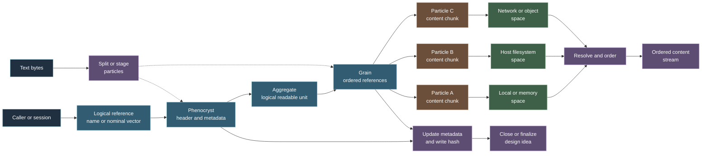

# Virtual Operating Layer Filesystem Overview

Status: Draft
Last-Touched: 2026-08-23
Depends-On: docs/fs/readme.md, docs/fs/File System.md, docs/fs/file-resolution.md, docs/fs/grains.md, docs/fs/grain-iterator.md, docs/fs/representation.md

## Filesystem at a Glance



This is a conceptual view of the proposed model, not a finalized data format
or command protocol. (Source: docs/fs/readme.md; docs/fs/File System.md;
docs/fs/Space and Space Discovery.md; docs/fs/representation.md)

## Purpose and Scope

This document reorganizes the filesystem research notes into a readable working
model. It is an orientation document, not a protocol specification. The source
notes contain several alternatives, tentative names, and unresolved questions;
those are preserved as gaps instead of being silently resolved.

The filesystem is referred to in the notes as VFS or VOL FS. This document uses
"filesystem" for the overall concept and retains the source terms when naming a
particular object.

## The Short Answer

The proposed filesystem is a virtual content layer that presents readable and
writable data without requiring the user's logical unit to be one contiguous
host file. It can bridge host filesystems, memory, network services, and object
storage, while representing content as metadata plus references to separately
stored byte or binary chunks. (Source: docs/fs/readme.md; docs/core/structure.md;
docs/fs/Space and Space Discovery.md)

The user-facing unit is usually called a file, but the internal model describes
that unit as an **aggregate**. An aggregate is resolved through a header or
**phenocryst**, one or more **grains**, and references to **particles**. A
particle is a chunk of content. The filesystem resolves the references and can
return the result as an ordered stream. (Source: docs/fs/File System.md;
docs/fs/concepts.md)

In one sentence:

> A logical item is a named aggregate whose metadata identifies an ordered
> composition of independently stored particles, and whose references can be
> resolved through local or remote spaces.
>

That sentence is a synthesis of the notes, not a finalized normative definition.
The relationship between a file, an aggregate, a grain, and a colloid still
needs an explicit decision. (Source: docs/fs/File System.md; docs/fs/Nomenclature.md)

## What Problem the Filesystem Is Trying to Address

The research notes are aimed at a filesystem that can:

- represent linear content as distributed chunks rather than one contiguous
  host allocation;
- read those chunks in logical order as a stream;
- use local memory, host filesystems, network services, and object stores as
  possible backing spaces;
- retain metadata about identity, location, permissions, and changes outside
  the raw content chunks;
- hash content as it is written and record the resulting state in metadata;
- support history, transactions, encryption, and backups as properties of the
  virtual layer; and
- eventually bridge volatile and persistent storage into a more homogeneous
  memory model.

The first four items are repeated as the central direction of the filesystem
notes. Hashing, encryption, history, and the unified-memory direction are
stated goals or design ideas, not complete mechanisms. (Source: docs/fs/readme.md;
docs/core/structure.md; docs/fs/stock-coms.md)

## Conceptual Model

### Host Layer and Virtual Layer

The **HOST** is the existing storage environment. The notes describe a host
adapter that can read and write an existing filesystem such as EXT4 or NTFS.
The **VFS** is the custom virtual layer that keeps graph-oriented data,
references, and virtual metadata. The virtual layer is intended to be able to
use the host without adopting the host's file and directory model as its own.
(Source: docs/core/structure.md; docs/fs/file-resolution.md)

The notes also describe a future byte-oriented implementation closer to the
underlying device or a homogeneous memory space. That is a future direction,
not a current storage contract. (Source: docs/fs/readme.md;
docs/fs/file-resolution.md)

### Space and Membrane

A **space** is a service-backed storage location and its configuration. A space
may use local storage, memory, FTP, S3, another network service, or another
configured store. Space discovery is described as selecting an allowed and
viable location using session, permission, membrane, thread, and remote
context. (Source: docs/fs/Space and Space Discovery.md;
docs/fs/stock-coms.md)

The **membrane** is described as the connective network layer between a host
volume, the filesystem, user space, and remote spaces. It is a conceptual
boundary and transport context; the notes do not define a protocol for it.
(Source: docs/fs/File System.md; docs/fs/Space and Space Discovery.md)

### Phenocryst: Header and Entry Reference

A **phenocryst** is an independent header or metadata reference associated with
an aggregate. The notes place file-like metadata here, including a local name,
creation information, permissions, location information, and a current or
immediate hash. (Source: docs/fs/File System.md; docs/core/structure.md;
docs/fs/representation.md)

The header is important because it connects a human or session reference to the
content organization. Several notes also warn that losing the header may make
otherwise stored chunks unusable. (Source: docs/core/structure.md;
docs/fs/File System.md)

### Aggregate: Logical Readable Unit

An **aggregate** is described as a readable unit made from an ordered list of
particle pointers. The filesystem resolves the pointers, obtains particle
content, and exposes either discrete chunks or a stream to the requesting
interface. (Source: docs/fs/File System.md)

The notes distinguish system-generated aggregates called **peds** from
user-generated aggregates called **clods**, and use **mass** for a larger
collection of peds and clods. These names are descriptive vocabulary only until
their creation and composition rules are defined. (Source: docs/fs/File System.md)

### Grain: Binding and Resolution Context

A **grain** maintains a header or reference set for particles and supplies the
organization needed to resolve them as part of a larger item. A grain can refer
to local or remote filesystem services, and its particles may be resolved
independently before the grain orders their results. (Source: docs/fs/grains.md;
docs/fs/File System.md)

The notes use the word grain in more than one way. One note calls it a single
executable unit, while the filesystem notes describe it as a particle pointer
or a group of particles. The execution meaning must not be assumed to be part
of ordinary file reads. (Source: docs/fs/concepts.md; docs/fs/grains.md)

### Particle: Content Chunk

A **particle** is a chunk of bytes or binary content associated with a larger
aggregate. The notes describe a particle as a unit that can be stored in local
memory, on disk, or in another abstract store. A particle address is intended
to be unique even when a human-facing particle name is shared. (Source: docs/fs/File System.md;
docs/fs/memory allocation table.md; docs/fs/Nomenclature.md)

The particle model allows content to be split when a storage allocation or
width is exhausted. The notes also describe solid, fluid, and floating phases:
solid content is persistently stored, fluid content is volatile or cached, and
floating content lacks an applied graph or owner. The transitions and
retention rules for these phases are not defined. (Source: docs/fs/File System.md)

### Colloid: Fetch or Read Operation

A **colloid** is described as a read or fetch construct that collects and
resolves particles through an association of names or space. A colloid may
return particles, grains, or a resulting stream, depending on what is being
fetched. (Source: docs/fs/File System.md; docs/fs/representation.md)

The notes also describe applying a colloid as a way to associate particles
under a grain. This makes colloid partly an operation and partly a returned
collection. That dual use is a terminology issue requiring clarification.
(Source: docs/fs/File System.md; docs/fs/representation.md)

### Names and Vectors

A **nominal vector** is a group of words used as a name or address-like
association. The notes focus on a three-key form, such as
`audio.eric.wedding`, and describe each key as potentially selecting a
nominal space or service. A longer vector is said to be possible without
changing the basic idea. (Source: docs/fs/Nomenclature.md;
docs/fs/nonimal-vector-names.md)

The notes also describe a local friendly name that expands to a vector and a
subsection marker such as `audio.eric.wedding:main-morning-speech`. The exact
syntax, escaping rules, namespace rules, and collision behavior are not
specified. (Source: docs/fs/nonimal-vector-names.md)

A nominal vector is therefore best treated as a naming proposal, not yet as a
physical address. The particle's unique address and the human-facing vector
name are separate concepts in the notes. (Source: docs/fs/Nomenclature.md)

### Allocation, Open Table, and Access

The **allocation table** is described as a record relating particles to
storage locations such as memory, disk, FTP, or S3. The notes say that a
particle may be allocated or locked for runtime use and may spill into further
particles. The table's concrete record format is not provided. (Source: docs/fs/memory allocation table.md;
docs/fs/stock-coms.md)

The **open table** is a graph-header area for active file references, open
handles, counters, and readers. The proposed flow is: request a file, find its
open-table header, assign counters and readers, and expose filesystem utilities
through that assigned header. (Source: docs/fs/open table.md)

Access notes describe authenticating a header, receiving a reserved address,
and using a returned key for later reads and writes. This is an access pattern
sketch, not a complete permission or credential protocol. (Source: docs/fs/shared mem view permissioning.md)

## How Reading Is Supposed to Work

The source notes imply the following conceptual read path:

1. A caller supplies a logical name, vector, or other reference.
2. The filesystem resolves the phenocryst or header for that reference.
3. The header identifies the aggregate and its grain or particle references.
4. Each pointer is resolved through its assigned local or remote space.
5. The filesystem applies any required transport or decryption step described
   for that content.
6. The grain or aggregate orders the returned particle content.
7. The caller receives discrete particles or an ordered stream.

This sequence combines the aggregate example, grain description, space model,
and pointer-stepping notes. It is a conceptual flow; the source material does
not define a single API call sequence or failure contract. (Source: docs/fs/File System.md;
docs/fs/grains.md; docs/fs/file-resolution.md;
docs/fs/Space and Space Discovery.md)

A grain iterator is described as stepping from position 0 through position n,
quietly resolving each space and particle until the expected information has
been yielded. A user should see the ordered stream rather than the individual
particle steps. The ordering key and behavior when references change during
iteration remain unspecified. (Source: docs/fs/grain-iterator.md)

The graph notes provide a related stepper abstraction that loads a key,
resolves a next step, and executes pointer actions in context. They do not
establish that every data particle is executable or that filesystem iteration
must use the graph stepper. (Source: docs/core/graph stepper.md;
docs/core/graph pointer.md; docs/core/graph functions.md)

## What Saving Text Would Look Like

### Important Qualification

The notes do not define a canonical `save` command, a serialized aggregate
schema, or an atomic commit protocol. The following is a source-grounded
lifecycle assembled from the documented ideas. It is a working model for
research discussion, not an implementation requirement.

### Conceptual Lifecycle

#### 1. Establish the caller and space

The caller identifies a session and authenticates the relevant header or user
space. Space discovery then considers the session, permissions, membrane, local
and remote services, and available storage locations. (Source: docs/fs/shared mem view permissioning.md;
docs/fs/Space and Space Discovery.md)

#### 2. Resolve or create the logical item

For an existing item, the caller resolves its phenocryst or header and opens a
reference through the open table. For a new item, the notes describe an entry
point that stores a colloid against a reference, but they do not settle whether
the first persistent object is a colloid, grain, aggregate, or phenocryst.
(Source: docs/fs/readme.md; docs/fs/open table.md;
docs/fs/representation.md)

#### 3. Convert text into content units

The text is treated as bytes or binary content. The filesystem divides it into
particles according to the selected allocation and storage constraints. When a
particle's available width is exhausted, the notes describe continuing into
additional particles. The exact chunking rule is not defined. (Source: docs/fs/memory allocation table.md;
docs/fs/File System.md)

#### 4. Store or stage the particles

Each particle is sent to a selected space. The notes describe local, memory,
network, FTP, S3, and IPFS-style locations as possible services or bridges.
The returned particle address is intended to identify the stored content, with
persistent confirmation mentioned before the address is returned. (Source: docs/fs/stock-coms.md;
docs/fs/Space and Space Discovery.md; docs/fs/Nomenclature.md)

A particle may be solid in persistent storage or fluid while held in volatile
memory. The source material does not define whether a write must make every
particle solid before the logical item becomes visible. (Source: docs/fs/File System.md)

#### 5. Bind the particle references

The aggregate or grain records the particle references in the order needed to
reconstruct the text. The particle itself does not need to be stored beside
its siblings; the aggregate's reference organization supplies the logical
relationship. (Source: docs/fs/readme.md; docs/fs/File System.md;
docs/fs/grains.md)

#### 6. Update metadata and the write hash

The filesystem notes say that a file-like structure keeps a current hash as
writes occur and that an open hash is written to file metadata when the file is
closed. The phenocryst or header is the stated place for persistent metadata
such as the local name and immediate hash. (Source: docs/fs/readme.md;
docs/fs/File System.md; docs/fs/representation.md)

This is the closest documented equivalent to save finalization. Whether close
means commit, whether a failed close leaves a readable prior version, and how
history is linked are not specified. (Source: docs/fs/readme.md;
docs/core/structure.md)

#### 7. Read back through the same logical reference

A subsequent read resolves the header, follows the ordered particle references,
and yields the text as a stream. A readback check is a natural validation of the
reference order and stored content, but the notes do not define a formal
verification command or checksum comparison procedure. (Source: docs/fs/File System.md;
docs/fs/grain-iterator.md)

### Illustrative Low-Level Conversation

The representation notes show conceptual commands like these:

```text
> INITIATE SPACE as {name} with @keyfile
< 0x123456
> OPEN @userkey 0/0 foo.bar.baz
> AGGLOMERATE particle.reference.name content
> COLLOID particle.reference.name
< PARTICLE content
```

These lines illustrate the vocabulary of space initiation, opening, aggregation,
and colloid fetching. They are not a confirmed command grammar, and the notes
do not define a literal `TEXT` or `SAVE` command. (Source: docs/fs/representation.md;
docs/fs/shared mem view permissioning.md)

A text-specific example can therefore be described only at the data-model
level:

```text
logical reference: notes.example.text
text bytes:        "first line\nsecond line\n"
particle order:    [particle-address-1, particle-address-2, ...]
header metadata:   logical reference, location references, owner, current hash
read result:       ordered text stream
```

The field names and address syntax in this block are illustrative labels, not a
proposed wire format. The source provides examples of metadata and addresses
but does not define this schema. (Source: docs/fs/representation.md;
docs/fs/File System.md)

### Editing Existing Text

The synthetic-marker notes propose placing a marker at an iteration point and
injecting another particle or replacing a transient pointer. This is intended
to avoid moving all later remote bytes when content is inserted into a large
remote dataset. The notes do not specify whether markers are part of the
aggregate, grain, particle, or header schema, so marker-based editing remains a
design idea. (Source: docs/fs/synthetic-markers.md)

## Key Features and How They Work

### Indirection Instead of Contiguous Files

The logical item stores references to chunks rather than requiring a linear
physical address list. This allows a chunk to remain in its storage location
while the aggregate changes its logical ordering or membership. The notes
present this as a way to reduce overwriting and allow distributed content.
(Source: docs/fs/readme.md; docs/fs/File System.md)

### Ordered Streaming

Particles may be independently resolved, then stepped in aggregate order and
returned as a stream. This makes a large item consumable without requiring the
whole aggregate to be materialized at once. The source notes describe the
behavior, but do not specify buffering, backpressure, or partial-read rules.
(Source: docs/fs/File System.md; docs/fs/grains.md;
docs/fs/grain-iterator.md; docs/fs/stock-coms.md)

### Multiple Backing Services

The space abstraction allows the same logical layer to work across local
storage, memory, host filesystems, network transport, FTP, S3, and proposed
IPFS integration. Each space needs a service configuration and a translation
between the virtual particle reference and the backing service. (Source: docs/fs/Space and Space Discovery.md;
docs/fs/stock-coms.md)

### Metadata Outside Raw Content

The header is intended to hold identity, permissions, location, dates, and hash
information separately from the chunks. The structure notes also describe a
separate header record that may chain to other headers and may retain
transaction information. (Source: docs/core/structure.md; docs/fs/File System.md)

### Hash Tracking

The filesystem notes propose automatic hashing and describe a hash for the
current file-like state, including an open hash during writing and metadata
persistence on close. The hash algorithm, scope, canonical byte representation,
and verification behavior are not defined. (Source: docs/fs/readme.md;
docs/fs/representation.md)

### History and Transaction References

The virtual filesystem is described as maintaining automatic history and
transaction references. Another design describes each edit as a graph leaf and
an ordered record that can rebuild the content from distributed pieces. These
ideas explain the motivation for retaining references beyond the latest raw
bytes, but do not define version selection or garbage collection. (Source: docs/core/structure.md)

### Encryption and Access Control

The notes propose encryption and decryption at the filesystem boundary and
suggest that individual chunks could have their own encryption routine. They
also describe header authentication and a key that grants access to a graph of
allowed user content. Key creation, rotation, scope, and revocation are not
specified. (Source: docs/fs/readme.md; docs/core/structure.md;
docs/fs/shared mem view permissioning.md)

### Lazy Resolution and Caching

The filesystem is described as resolving particle pointers as needed, with
remote or persistent content potentially being accessed and cached early. This
supports partial consumption of a larger aggregate, but cache ownership,
expiry, and consistency are not defined. (Source: docs/fs/file-resolution.md;
docs/fs/stock-coms.md)

### Synthetic Markers

Markers are proposed as iteration breakpoints for multi-pointer work,
fragmented particle stepping, injected updates, encrypted blocks, and transient
pointer replacement. They are a useful feature candidate, but their precedence
and interaction with hashes and history require a decision. (Source: docs/fs/synthetic-markers.md)

## Reasoning and Considerations

### Why Use Chunks and References?

The notes give several reasons for the indirection model:

- a logical item can span different spaces;
- a caller can receive content incrementally;
- changing the reference organization need not move every existing chunk;
- a remote insertion can be represented with a marker rather than a full-file
  transfer; and
- metadata and content can be managed as separate concerns.

These are design motivations recorded by the research notes. They should be
validated against concrete workloads before becoming performance claims.
(Source: docs/fs/readme.md; docs/fs/File System.md;
docs/fs/synthetic-markers.md; docs/core/structure.md)

### Costs and Risks Already Visible in the Notes

The same design introduces risks that the source material itself points toward:

- losing the phenocryst or header may make chunks difficult or impossible to
  reconstruct;
- ordering references must remain correct for a stream to be meaningful;
- remote resolution can delay a read;
- particles may become orphaned when references or headers disappear;
- permission failures can prevent a grain from resolving;
- hashes require a defined canonical state and lifecycle; and
- graph-based history can make the current content easy to identify but the
  reconstruction rules harder to define.

The orphan and cold-store behavior is mentioned in the notes, but the trigger,
retention period, and recovery procedure are not defined. (Source: docs/fs/File System.md;
docs/fs/grains.md; docs/core/structure.md)

### Relationship to Graph Execution

The broader VOL documentation describes graph pointers, steppers, execution
source, and frame context. The filesystem uses graph-like references and may be
resolved through graph services, but the notes do not establish that ordinary
text content executes when read. Data resolution and graph execution should
remain separate concepts until their boundary is explicitly specified.
(Source: docs/fs/File System.md; docs/core/graph pointer.md;
docs/core/graph stepper.md; docs/core/graph functions.md)

## Terminology Collisions to Resolve

Naming Collision: file/aggregate - "file" is the user-facing analogy, while
aggregate is the internal readable unit. Decide whether one is an alias or
whether they have distinct scopes. (Source: docs/fs/File System.md;
docs/fs/Nomenclature.md)

Naming Collision: grain/pointer/executable unit - grains are described as
particle-reference groups, pointer-like addresses, and an executable unit in
different notes. Define the filesystem meaning independently from graph
execution. (Source: docs/fs/concepts.md; docs/fs/grains.md;
docs/core/graph pointer.md)

Naming Collision: colloid/read result/collection - colloid is used as a
function, a fetch operation, and a collection of resolved particles. Choose an
operation/result distinction or document the intentional polymorphism.
(Source: docs/fs/File System.md; docs/fs/representation.md)

Naming Collision: header/phenocryst - both identify metadata and aggregate
references, but their ownership and persistence boundaries are not explicit.
(Source: docs/fs/File System.md; docs/core/structure.md)

Naming Collision: particle/segment/block/sector - the notes use all of these
for related or possibly different units. Define whether these are aliases,
logical layers, or physical storage units. (Source: docs/fs/File System.md;
docs/fs/memory allocation table.md; docs/core/structure.md)

## More Information Required

### Canonical Data Model

Incomplete: Persistent object hierarchy

Needed:

- A definitive relationship among phenocryst, aggregate, grain, colloid, and
  particle.
- Which objects are persisted and which are only runtime views or operations.
- Whether a grain can contain grains, particles, or both in the canonical model.

Candidate Sources: docs/fs/File System.md, docs/fs/concepts.md,
docs/fs/representation.md

### Identity and Addressing

Incomplete: Address and name schemas

Needed:

- The grammar and cardinality of a nominal vector.
- The uniqueness and lifetime rules for particle addresses.
- The relationship between a friendly name, vector, phenocryst identifier,
  graph key, and physical location.
- Rules for escaping separators and handling name collisions.

Candidate Sources: docs/fs/Nomenclature.md, docs/fs/nonimal-vector-names.md,
docs/fs/File Names.md, docs/core/graph key names.md

### Write and Version Semantics

Incomplete: Save transaction

Needed:

- The exact stages of open, stage, publish, close, commit, and abort.
- Atomicity and visibility when only some particles persist.
- Whether a failed write leaves the previous version readable.
- How history links versions and how a reader selects a version.
- How synthetic markers participate in hashes and version identity.

Candidate Sources: docs/fs/readme.md, docs/core/structure.md,
docs/fs/synthetic-markers.md

### Chunking and Physical Allocation

Incomplete: Particle layout

Needed:

- Minimum, maximum, or adaptive particle sizes.
- Whether a particle may be rewritten in place.
- The allocation table schema and locking rules.
- Mapping between logical particle addresses and host/object/device locations.
- Recovery when a location is unavailable or a remote service changes.

Candidate Sources: docs/fs/memory allocation table.md, docs/fs/file-resolution.md,
docs/fs/stock-coms.md

### Permissions and Cryptography

Incomplete: Access and protection contract

Needed:

- Permission subjects and scopes.
- Inheritance from header to aggregate, grain, and particle.
- Read, write, append, execute, and metadata access behavior.
- Key format, rotation, revocation, and remote delegation.
- Hash and encryption algorithms, canonical inputs, and failure behavior.

Candidate Sources: docs/fs/shared mem view permissioning.md,
docs/core/structure.md, docs/fs/readme.md

### Resolution and Execution Boundary

Incomplete: Resolver behavior

Needed:

- Ordering guarantees and mutation rules during iteration.
- Retry, timeout, partial-result, and cancellation behavior.
- Cache consistency and invalidation rules.
- Whether a grain or particle can execute code, and what authorization is
  required before execution.
- The exact boundary between filesystem resolution and graph stepping.

Candidate Sources: docs/fs/grain-iterator.md, docs/fs/file-resolution.md,
docs/core/graph stepper.md, docs/core/graph functions.md

### Lifecycle and Recovery

Incomplete: Orphan and garbage-collection policy

Needed:

- The definition of an orphan after a header, grain, or reference disappears.
- The delay and conditions for cold-store movement.
- How an orphan can be recovered or safely deleted.
- How history, backups, and duplicate references affect collection.

Candidate Sources: docs/fs/File System.md, docs/fs/grains.md,
docs/core/structure.md

## Current Working Summary

The strongest current concept is a graph-oriented virtual filesystem in which a
named logical item resolves to ordered content chunks across configurable
spaces. Its motivating features are distributed storage, streaming reads,
metadata-separated from raw content, hash-tracked writes, and the possibility
of history, encryption, and marker-based edits. (Source: docs/fs/readme.md;
docs/fs/File System.md; docs/core/structure.md)

A text save can therefore be discussed as: authenticate a space, open or create
a logical reference, split text into particles, persist or stage those
particles, record their ordered references in a grain or aggregate, update the
header and write hash, and close or otherwise finalize the item. The ordering
and object choices in that sentence are the current synthesis, not a settled
protocol. (Source: docs/fs/readme.md; docs/fs/open table.md;
docs/fs/memory allocation table.md; docs/fs/grains.md;
docs/fs/representation.md)

The next research step is not to add more implementation detail by assumption.
It is to choose the canonical object hierarchy and write lifecycle, then define
the smallest explicit schemas needed to test them.

## Verbatim Scope

Filesystem sources read for this overview:

- docs/fs/readme.md
- docs/fs/concepts.md
- docs/fs/File System.md
- docs/fs/file-resolution.md
- docs/fs/grains.md
- docs/fs/grain-iterator.md
- docs/fs/representation.md
- docs/fs/File Names.md
- docs/fs/FS vol top level naming.md
- docs/fs/memory allocation table.md
- docs/fs/open table.md
- docs/fs/shared mem view permissioning.md
- docs/fs/Nomenclature.md
- docs/fs/nonimal-vector-names.md
- docs/fs/Key graph with a stepping graph.md
- docs/fs/Space and Space Discovery.md
- docs/fs/stock-coms.md
- docs/fs/synthetic-markers.md
- docs/fs/build-assets.md

Adjacent synthesis and core sources read for context:

- ai-docs/fs-overview.md
- ai-docs/memory-identity-overview.md
- ai-docs/graph-overview.md
- docs/core/terminology.md
- docs/core/structure.md
- docs/core/os-runtime.md
- docs/core/boot.md
- docs/core/graph pointer.md
- docs/core/graph stepper.md
- docs/core/graph functions.md

Prototype code was not used as authority for filesystem behavior. The repository
instructions identify docs as authoritative for this phase and experimental code
as a source of questions only.
